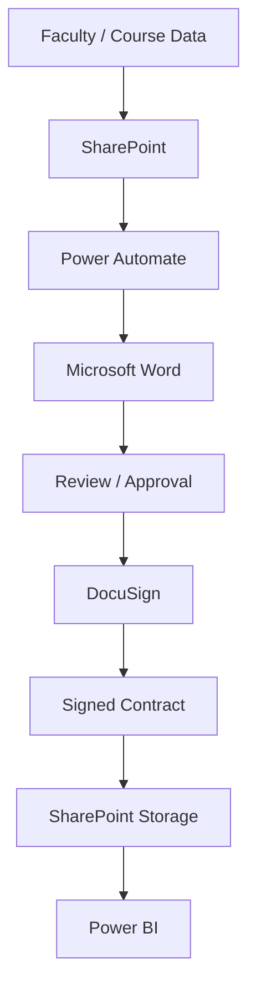

# Adjunct Faculty Contract Management System

> An automated Microsoft 365 solution for managing faculty contract data, contract generation, electronic signatures, document storage, workflow status, and reporting.

---

## Project Overview

The **Adjunct Faculty Contract Management System** is an integrated workflow designed to streamline the contract-management process.

The solution combines Microsoft 365 services with electronic-signature capabilities to reduce repetitive manual work, improve data consistency, centralize documents, and provide visibility into contract status.

### Core Technologies

* **SharePoint** — Data and document management
* **Power Automate** — Workflow automation
* **Microsoft Word** — Contract templates
* **DocuSign** — Electronic signatures
* **Power BI** — Reporting and analytics

---

## Problem

A manual contract-management process can require users to:

* Collect faculty information
* Maintain course information
* Create contracts
* Review documents
* Route contracts for approval
* Send contracts for signatures
* Track signing status
* Store completed documents
* Monitor outstanding contracts
* Prepare status reports

These activities can introduce repetitive work, inconsistent data, document-management challenges, and limited visibility into the current status of contracts.

---

## Solution

The system connects data management, workflow automation, contract generation, electronic signatures, document storage, and reporting into one integrated process.

```text
                    ┌──────────────────┐
                    │    SharePoint    │
                    │  Data Management │
                    └────────┬─────────┘
                             │
                             ▼
                    ┌──────────────────┐
                    │  Power Automate  │
                    │ Workflow Engine  │
                    └────────┬─────────┘
                             │
                    ┌────────┴────────┐
                    ▼                 ▼
          ┌─────────────────┐   ┌──────────────┐
          │ Microsoft Word  │   │   Approval   │
          │ Contract        │   │    Process   │
          │ Generation      │   └──────┬───────┘
          └────────┬────────┘          │
                   └──────────┬────────┘
                              ▼
                       ┌──────────────┐
                       │   DocuSign   │
                       │ E-Signature  │
                       └──────┬───────┘
                              │
                              ▼
                       ┌──────────────┐
                       │  SharePoint  │
                       │   Storage    │
                       └──────┬───────┘
                              │
                              ▼
                       ┌──────────────┐
                       │   Power BI   │
                       │  Reporting   │
                       └──────────────┘
```

---

## Key Features

### Data Management

* Centralized faculty information
* Course and schedule information
* Contract records
* Structured SharePoint lists
* Document libraries

### Contract Automation

* Automated contract generation
* Standardized templates
* Automated workflow routing
* Status tracking
* Duplicate-prevention logic

### Electronic Signatures

* Electronic contract delivery
* Signature tracking
* Completion status
* Signed-document storage

### Reporting

Power BI can provide visibility into:

* Contract status
* Pending contracts
* Completed contracts
* Processing information
* Other approved project metrics

---

## How the Workflow Works

```text
1. Data Entered
       ↓
2. SharePoint Record
       ↓
3. Data Validation
       ↓
4. Contract Generation
       ↓
5. Review / Approval
       ↓
6. DocuSign
       ↓
7. Electronic Signature
       ↓
8. Signed Contract Stored
       ↓
9. Status Updated
       ↓
10. Power BI Reporting
```

The workflow is designed to combine automation with human review rather than attempting to automate every business decision.

---

## System Architecture

The system uses a layered architecture.

```text
┌───────────────────────────────────────────┐
│              User / Business              │
└─────────────────────┬─────────────────────┘
                      │
                      ▼
┌───────────────────────────────────────────┐
│              SharePoint                   │
│        Data + Document Management         │
└─────────────────────┬─────────────────────┘
                      │
                      ▼
┌───────────────────────────────────────────┐
│            Power Automate                 │
│         Workflow Orchestration            │
└──────────┬──────────┬──────────┬─────────┘
           │          │          │
           ▼          ▼          ▼
       Microsoft   DocuSign   SharePoint
         Word                  Storage
           │                     │
           └──────────┬──────────┘
                      ▼
               ┌──────────────┐
               │   Power BI   │
               │   Reporting  │
               └──────────────┘
```

See:

**[System Architecture](architecture/system-architecture.md)**

---

## Project Components

| Component      | Purpose                          |
| -------------- | -------------------------------- |
| SharePoint     | Data and document management     |
| Power Automate | Workflow automation              |
| Microsoft Word | Contract template and generation |
| DocuSign       | Electronic signatures            |
| Power BI       | Reporting and analytics          |

---

## Data Flow

```text
Source Information
       ↓
SharePoint
       ↓
Power Automate
       ↓
Contract Template
       ↓
Generated Contract
       ↓
Review
       ↓
Electronic Signature
       ↓
Signed Document
       ↓
SharePoint
       ↓
Power BI
```

---

## Security Considerations

Security was considered as part of the system design.

Key concepts include:

* Access control
* Least privilege
* Controlled document access
* Data validation
* Secure document storage
* Workflow authorization
* Auditability
* Minimizing unnecessary information exposure

The public GitHub documentation does **not** contain real faculty information, credentials, contracts, access tokens, or other confidential information.

See:

**[Security & Compliance](docs/security-and-compliance.md)**

---

## Testing

The system can be evaluated through multiple levels of testing:

```text
Component Testing
       ↓
Workflow Testing
       ↓
Integration Testing
       ↓
Negative Testing
       ↓
Security Testing
       ↓
User Acceptance Testing
       ↓
Final Validation
```

Testing areas include:

* SharePoint data
* Power Automate workflows
* Contract generation
* Approval processing
* Electronic signatures
* Document storage
* Status tracking
* Power BI reporting
* Access control

See:

**[Testing & Quality Assurance](docs/testing.md)**

---

## Project Contribution

The project demonstrates experience with:

### IT / Systems

* Requirements analysis
* System architecture
* Workflow design
* System integration
* Data management
* Document management
* Testing
* Technical documentation

### Microsoft 365

* SharePoint
* Power Automate
* Power BI
* Microsoft Word

### Security

* Access control
* Least privilege
* Data validation
* Secure document handling
* Security-aware system design
* Information exposure reduction

See:

**[Project Contribution](docs/project-contribution.md)**

---

## Documentation

| Document                                                   | Description                                 |
| ---------------------------------------------------------- | ------------------------------------------- |
| [System Architecture](architecture/system-architecture.md) | Overall technical architecture and workflow |
| [Data Collection](workflows/data-collection.md)            | Data-management workflow                    |
| [Contract Generation](workflows/contract-generation.md)    | Automated contract-generation process       |
| [Signing & Reporting](workflows/signing-and-reporting.md)  | Electronic signatures and reporting         |
| [Security & Compliance](docs/security-and-compliance.md)   | Security considerations                     |
| [Testing](docs/testing.md)                                 | Testing strategy and test cases             |
| [Project Contribution](docs/project-contribution.md)       | Technical contribution and skills           |

---

## Project Workflow

### 1. Data Management

Information is maintained in structured SharePoint data sources.

### 2. Validation

The workflow checks information before continuing.

### 3. Contract Generation

Power Automate uses the available information to populate a standardized contract template.

### 4. Review

The generated contract can be reviewed before continuing.

### 5. Electronic Signature

Approved contracts can be routed through DocuSign.

### 6. Document Storage

Completed documents are stored in SharePoint.

### 7. Reporting

Power BI provides reporting and visualization of approved contract-status information.

---

## Example Architecture



---

## Skills Demonstrated

This project demonstrates practical experience in:

**Microsoft 365**

`SharePoint` · `Power Automate` · `Power BI` · `Microsoft Word`

**Automation**

`Workflow Automation` · `Approvals` · `Notifications` · `Status Tracking`

**Data**

`Data Management` · `Validation` · `Document Management` · `Reporting`

**Security**

`Access Control` · `Least Privilege` · `Data Protection` · `Auditability`

**Project Development**

`Requirements Analysis` · `System Design` · `Integration` · `Testing` · `Documentation`

---

## Portfolio Purpose

This repository documents the architecture, workflow design, testing approach, security considerations, and technical contributions associated with the project.

It is intended as a professional portfolio example demonstrating how Microsoft 365 technologies can be integrated to solve a real-world business-process problem.

---

## Privacy & Security Notice

This public repository uses sanitized and generalized information.

It does not intentionally contain:

* Real personal information
* Faculty records
* Real contracts
* Passwords
* API keys
* Access tokens
* Private credentials
* Confidential documents
* Restricted organizational information

Any example data should be treated as demonstration data only.

---

## Project Status

**Documentation:** Active
**Architecture:** Documented
**Workflow:** Documented
**Testing Strategy:** Documented
**Security Considerations:** Documented
**Portfolio Version:** Public / Sanitized

---

## Conclusion

The **Adjunct Faculty Contract Management System** demonstrates how cloud-based productivity platforms can be integrated to automate a multi-step business process.

The solution combines:

```text
Data Management
       +
Workflow Automation
       +
Document Generation
       +
Electronic Signatures
       +
Document Storage
       +
Business Intelligence
       +
Security
```

The result is a structured, automated workflow designed to reduce repetitive work, improve visibility, and support more consistent contract processing.
