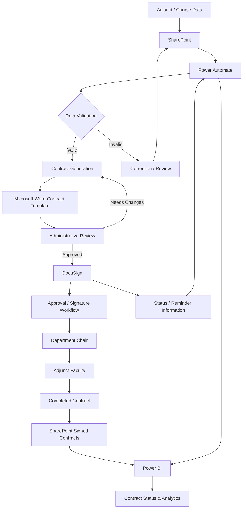
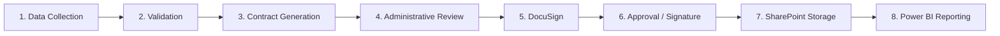
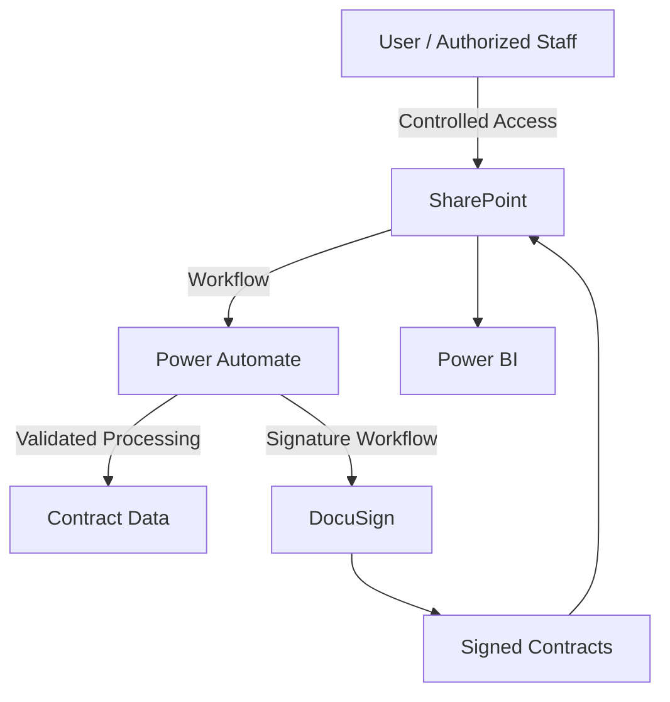

# System Architecture

## Adjunct Faculty Contract Management System

The **Adjunct Faculty Contract Management System** is a Microsoft 365-based workflow solution designed to centralize adjunct faculty and course information, automate contract generation and routing, support electronic signatures, securely store completed contracts, and provide contract-status reporting.

The system integrates:

* **SharePoint** — data and document management
* **Power Automate** — workflow automation
* **Microsoft Word** — contract templates
* **DocuSign** — electronic signatures
* **Power BI** — reporting and analytics

---

## High-Level Architecture



### Architecture Summary

The system follows an end-to-end workflow:

```text
Data Collection
      ↓
SharePoint
      ↓
Power Automate
      ↓
Validation
      ↓
Contract Generation
      ↓
Administrative Review
      ↓
DocuSign
      ↓
Approval / Electronic Signature
      ↓
SharePoint
      ↓
Power BI
      ↓
Reporting
```

Microsoft documents SharePoint and Power Automate as an integrated platform for approval flows, list and file processing, document routing, and reminder workflows.

---

# System Components

## 1. SharePoint

SharePoint acts as the central data and document-management platform.

### Primary responsibilities

* Store adjunct faculty information
* Store course information
* Store contract records
* Store generated contracts
* Store completed/signed contracts
* Maintain workflow-related information
* Support controlled access to documents and data

### Conceptual data areas

```text
SharePoint
│
├── Adjunct Faculty Data
│
├── Course Data
│
├── Contract Records
│
└── Signed Contracts
```

SharePoint provides the central location from which Power Automate can retrieve and update list items and files.

---

# 2. Power Automate

Power Automate is the workflow and automation layer.

It connects the different components of the system and performs repetitive processing.

### Primary responsibilities

* Validate incoming records
* Detect duplicate information
* Generate contracts
* Route documents
* Trigger approval processes
* Send notifications
* Send reminders
* Update contract status
* Support document movement and storage
* Provide workflow information to reporting

Microsoft specifically documents SharePoint + Power Automate scenarios for document approvals, routing finished documents for approval, manipulating list items/files, and creating reminder flows.

---

# 3. Microsoft Word

Microsoft Word provides the contract template.

Power Automate uses information stored in the system to populate the appropriate fields in the contract template.

### Conceptual process

```text
SharePoint Data
      ↓
Power Automate
      ↓
Word Template
      ↓
Generated Contract
```

This reduces repetitive manual data entry and helps maintain a consistent contract format.

---

# 4. DocuSign

DocuSign provides the electronic-signature component of the workflow.

### Primary responsibilities

* Receive generated contracts
* Route documents for electronic signatures
* Track signature progress
* Support completion of the signing process
* Provide signing-status information

### Signing workflow

```text
Generated Contract
       ↓
    DocuSign
       ↓
Department Chair
       ↓
Adjunct Faculty
       ↓
Completed Contract
```

The exact routing sequence is based on the project's defined workflow.

---

# 5. Power BI

Power BI provides the reporting and analytics layer.

The dashboard can provide visibility into contract-processing activity and status.

### Example information

* Pending contracts
* Signed contracts
* Canceled contracts
* Contract-processing status
* Workflow progress
* Other project-defined metrics

### Reporting architecture

```text
SharePoint
    │
    ├──────────────┐
    │              │
    ▼              ▼
Contract Data   Status Data
    │              │
    └──────┬───────┘
           ▼
       Power BI
           │
           ▼
     Dashboard / Reports
```

---

# How the Workflow Works

## Step 1 — Collect Data

Adjunct faculty and course information is entered or imported into the system.

```text
Source Data
    ↓
SharePoint
```

The information becomes available to the automated workflow.

---

## Step 2 — Validate Data

Power Automate processes the information and performs validation.

The workflow checks for information required by the project before continuing.

```text
SharePoint Record
       ↓
Power Automate
       ↓
Validation
       ↓
Valid?
```

If the information is valid, processing continues.

If information requires correction, the record can be returned for review or correction.

---

## Step 3 — Generate Contract

Once the record is validated, Power Automate uses the available information to populate the contract template.

```text
Validated Record
       ↓
Power Automate
       ↓
Word Template
       ↓
Generated Contract
```

This reduces repetitive manual entry and helps maintain consistency between contracts.

---

## Step 4 — Administrative Review

The generated contract is reviewed before it proceeds to electronic signature.

```text
Generated Contract
       ↓
Administrative Review
       ↓
 ┌─────┴─────┐
 │           │
Approved   Changes Needed
 │           │
 ▼           ▼
DocuSign   Regenerate / Correct
```

Human review remains part of the process so that automated document generation does not eliminate necessary oversight.

---

## Step 5 — Send for Electronic Signature

After review, the contract enters the DocuSign workflow.

```text
Approved Contract
       ↓
    DocuSign
       ↓
Signature Workflow
```

The contract is routed to the appropriate parties according to the defined project process.

---

## Step 6 — Approval and Signing

The signing workflow involves the designated approval/signature participants.

```text
DocuSign
    ↓
Department Chair
    ↓
Adjunct Faculty
    ↓
Completed Contract
```

The workflow tracks the progress of the contract through the signing process.

---

## Step 7 — Reminders and Status Updates

Power Automate supports workflow notifications and reminders when contracts remain incomplete.

```text
Contract Pending
      ↓
Power Automate
      ↓
Reminder
      ↓
Status Update
```

The purpose is to reduce delays and provide better visibility into outstanding contracts.

---

## Step 8 — Store Completed Contract

Once the contract has been completed, the document is stored in the designated SharePoint location.

```text
Completed Contract
       ↓
SharePoint
       ↓
Signed Contracts
```

This provides a centralized location for completed contract documents.

---

## Step 9 — Reporting

Contract information and workflow status are used by Power BI to provide reporting.

```text
SharePoint
    +
Workflow Status
    ↓
Power BI
    ↓
Dashboard
```

The reporting layer allows users to monitor contract-processing activity without manually reviewing every individual record.

---

# End-to-End Workflow

The complete workflow can be summarized as:



---

# Workflow Responsibilities

| Component      | Primary Responsibility    |
| -------------- | ------------------------- |
| SharePoint     | Data and document storage |
| Power Automate | Workflow automation       |
| Word           | Contract template         |
| DocuSign       | Electronic signatures     |
| Power BI       | Reporting and analytics   |

---

# Security Architecture

Security considerations are incorporated throughout the workflow.



## Security Principles

### Least Privilege

Users should receive only the permissions required for their responsibilities.

### Access Control

Access to contract information and documents should be restricted to authorized users.

### Data Minimization

Only information necessary for the business process should be exposed to users.

### Secure Document Storage

Completed contracts should remain in controlled organizational storage.

### Auditability

Workflow and electronic-signature status information provides visibility into the progress of contract processing.

### Separation of Responsibilities

The workflow separates data management, contract review, approval, electronic signature, storage, and reporting functions.

---

# Failure / Exception Handling

The system should account for common workflow exceptions.

## Invalid Data

```text
Invalid Record
     ↓
Correction Required
     ↓
Data Updated
     ↓
Validation
```

## Contract Requires Changes

```text
Generated Contract
       ↓
Review
       ↓
Changes Required
       ↓
Correct Data / Template
       ↓
Regenerate
```

## Pending Signature

```text
Contract Pending
       ↓
Reminder
       ↓
Signature Completed
       ↓
Status Updated
```

## Rejected or Canceled Workflow

```text
Contract
   ↓
Review
   ↓
Rejected / Canceled
   ↓
Status Updated
   ↓
Reporting
```

Microsoft's contract-management guidance similarly uses Power Automate to move contracts through review and branch workflow behavior based on approval or rejection.

---

# Architecture Benefits

## Centralization

Contract-related information is managed through a centralized Microsoft 365 environment.

## Automation

Power Automate reduces repetitive manual processing.

## Consistency

Using a standardized contract template helps maintain consistent document formatting.

## Visibility

Power BI provides a reporting layer for monitoring contract status.

## Controlled Access

SharePoint permissions can be used to restrict access to sensitive documents and information.

## Scalability

The workflow can be expanded with additional validation, notification, reporting, or integration requirements.

---

# Technology Flow

```text
                    Microsoft 365
                         │
        ┌────────────────┼────────────────┐
        │                │                │
        ▼                ▼                ▼
   SharePoint      Power Automate      Power BI
        │                │                │
        │                │                │
        └───────┬────────┘                │
                │                         │
                ▼                         │
         Microsoft Word                  │
                │                         │
                ▼                         │
            DocuSign                     │
                │                         │
                ▼                         │
         Signed Contract ────────────────┘
```

---

# Design Summary

The architecture connects five primary technologies into one business workflow:

```text
SharePoint
    ↓
Data Management
    ↓
Power Automate
    ↓
Workflow Automation
    ↓
Microsoft Word
    ↓
Contract Generation
    ↓
DocuSign
    ↓
Electronic Signature
    ↓
SharePoint
    ↓
Document Storage
    ↓
Power BI
    ↓
Reporting & Analytics
```

The architecture demonstrates how multiple Microsoft 365 and third-party services can be integrated to automate a document-based business process while maintaining review, access control, storage, and reporting considerations.

---

# Portfolio Note

This architecture document describes the project's design at a portfolio level.

No individual names, personal information, credentials, real contract documents, or confidential organizational information should be included in this public repository.

Use sanitized examples or mock data for any future screenshots or demonstrations.
