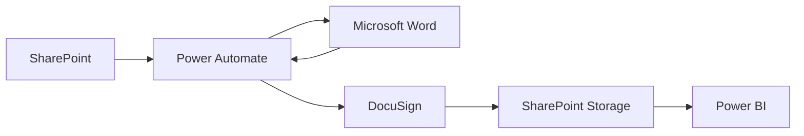
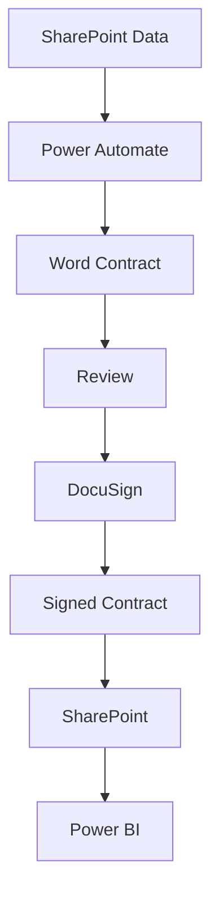
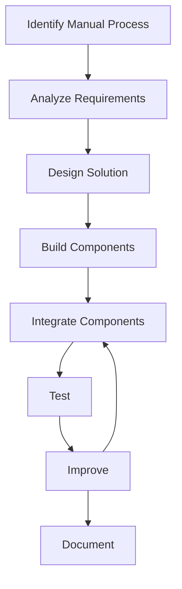

# Project Contribution

## Overview

The **Adjunct Faculty Contract Management System** is an automated contract-management solution designed to improve the process of collecting faculty information, generating contracts, routing documents for electronic signatures, storing completed contracts, and reporting contract status.

The solution uses Microsoft 365 technologies including:

* SharePoint
* Power Automate
* Microsoft Word
* DocuSign
* Power BI

The project combines business-process automation, document management, workflow design, data management, and security-aware system design.

---

# My Role

My contribution to the project focused on the design, development, documentation, testing, and integration of the contract-management workflow.

The work involved translating a manual business process into a structured Microsoft 365 solution.

The major areas of contribution were:

```text
Requirements Analysis
        ↓
System Design
        ↓
SharePoint Data Structure
        ↓
Power Automate Workflows
        ↓
Contract Generation
        ↓
Electronic Signature Workflow
        ↓
Reporting
        ↓
Testing
        ↓
Documentation
```

---

# 1. Requirements Analysis

The first stage was understanding the existing contract-management process and identifying opportunities for automation.

The analysis focused on:

* How faculty information was collected
* How course information was maintained
* How contracts were created
* How contracts were reviewed
* How contracts were signed
* How completed contracts were stored
* How contract status was tracked
* How reporting could be improved

The goal was to identify repetitive manual activities that could be handled by workflow automation.

---

# 2. System Design

The overall system was designed around Microsoft 365 services.



Each technology was assigned a specific responsibility.

| Technology     | Primary Responsibility       |
| -------------- | ---------------------------- |
| SharePoint     | Data and document management |
| Power Automate | Workflow automation          |
| Microsoft Word | Contract template            |
| DocuSign       | Electronic signatures        |
| Power BI       | Reporting and analytics      |

This separation helped create a modular architecture.

---

# 3. SharePoint Data Design

SharePoint was used as the central data-management and document-management platform.

The system included structured information for:

* Faculty
* Courses
* Contract records
* Coordinators
* Contract documents

Conceptually:

```text
SharePoint
│
├── Faculty Information
│
├── Course Information
│
├── Contract Records
│
├── Reference Data
│
└── Contract Documents
```

The data structure was designed to support both automation and reporting.

---

# 4. Data Workflow

The data workflow was designed to move information from source records into the contract-generation process.

```text
Source Data
    ↓
SharePoint
    ↓
Validation
    ↓
Contract Record
    ↓
Power Automate
```

The workflow was designed to reduce manual copying and repetitive data entry.

---

# 5. Power Automate Development

Power Automate served as the workflow orchestration layer.

Microsoft's current Power Automate guidance includes planning, designing, testing, deploying, monitoring, and refining cloud-flow solutions.

The project used Power Automate to coordinate activities such as:

* Data processing
* Contract generation
* Workflow routing
* Approval processing
* Notifications
* Status updates
* Document handling

Conceptually:

```text
SharePoint
     ↓
Power Automate
     ↓
Business Logic
     ↓
Next Workflow Stage
```

---

# 6. Contract Generation

A major part of the project was automating contract creation.

The workflow uses structured data to populate a standardized contract template.

```text
SharePoint Record
       ↓
Power Automate
       ↓
Word Template
       ↓
Generated Contract
```

The goal was to reduce:

* Manual data entry
* Copy-and-paste errors
* Inconsistent formatting
* Repetitive document preparation

The generated document could then move into the review process.

---

# 7. Contract Review

Automation was designed to assist users rather than completely remove human oversight.

The workflow includes a review stage:

```text
Generated Contract
       ↓
Administrative Review
       ↓
 ┌─────┴─────┐
 ↓           ↓
Approve    Correction
 ↓           ↓
DocuSign   Regenerate
```

This approach allows automated processing while retaining human review for important business decisions.

---

# 8. Electronic Signature Integration

DocuSign was incorporated into the workflow for electronic signatures.

The process was designed as:

```text
Approved Contract
       ↓
DocuSign
       ↓
Signature Workflow
       ↓
Completed Contract
```

This provides a structured transition from contract approval to electronic signing.

---

# 9. Contract Status Tracking

The workflow was designed to track contract progress.

Example status progression:

```text
Draft
  ↓
In Review
  ↓
Approved
  ↓
Pending Signature
  ↓
Completed
```

Exception states can include:

```text
Rejected
Canceled
Needs Correction
Expired
```

Status information provides the foundation for reporting and workflow monitoring.

---

# 10. Document Management

SharePoint serves as the document-management layer.

The conceptual document lifecycle is:

```text
Generated Contract
       ↓
Review
       ↓
Approved Contract
       ↓
Electronic Signature
       ↓
Completed Contract
       ↓
SharePoint Storage
```

This provides a centralized location for contract-related documents.

---

# 11. Power BI Reporting

Power BI was used as the reporting and analytics layer.

The reporting architecture is:

```text
SharePoint Data
      ↓
Contract Status
      ↓
Power BI
      ↓
Dashboard
```

Potential dashboard information includes:

* Total contracts
* Pending contracts
* Completed contracts
* Contract status
* Processing trends
* Term information
* Other approved metrics

The dashboard provides users with a higher-level view of workflow activity.

---

# 12. Workflow Integration

One of the major contributions was connecting the individual technologies into a single workflow.



Instead of treating each technology as a separate application, the project connects them into one business process.

---

# 13. Automation Design

The project focused on replacing repetitive manual steps with automated workflow actions.

### Manual approach

```text
Find Information
      ↓
Copy Information
      ↓
Create Contract
      ↓
Save Contract
      ↓
Send Contract
      ↓
Track Status
      ↓
Create Report
```

### Automated approach

```text
SharePoint
    ↓
Power Automate
    ↓
Contract Generation
    ↓
Review
    ↓
DocuSign
    ↓
SharePoint
    ↓
Power BI
```

This demonstrates how low-code automation can be used to connect multiple business applications.

---

# 14. Duplicate Prevention

Another important design consideration was preventing duplicate processing.

The workflow can use unique record information to identify whether a contract has already been generated.

Conceptually:

```text
Contract Record
      ↓
Check Existing Contract
      ↓
 ┌────┴────┐
 ↓         ↓
No        Yes
 ↓         ↓
Generate   Prevent Duplicate
```

Duplicate prevention reduces the possibility of multiple contracts being generated for the same underlying record.

---

# 15. Data Validation

Data validation was incorporated into the workflow design.

The process is:

```text
Incoming Data
      ↓
Validation
      ↓
 ┌────┴────┐
 ↓         ↓
Valid     Invalid
 ↓         ↓
Continue  Correct
```

Validation helps prevent incomplete or incorrect data from entering later workflow stages.

---

# 16. Testing Contribution

Testing covered multiple areas of the solution.

The testing approach included:

* Functional testing
* Workflow testing
* Integration testing
* Data validation
* Contract generation testing
* Approval testing
* Signature workflow testing
* Status testing
* Reporting validation
* Security testing

Microsoft recommends testing Power Automate cloud flows for reliability, performance, and accuracy and testing different possible flow outcomes.

---

# 17. Security-Aware Design

Security was considered throughout the system design.

Important principles included:

* Least privilege
* Role-based access
* Controlled document access
* Data minimization
* Secure document storage
* Workflow authorization
* Auditability

Conceptually:

```text
Access Control
      +
Least Privilege
      +
Data Protection
      +
Auditability
      ↓
Security-Aware Workflow
```

The system was designed so that users do not automatically need unrestricted access to all contract information.

---

# 18. Public Repository Security

The project was documented for a public GitHub portfolio using sanitized information.

The repository should not contain:

* Real faculty names
* Personal information
* IDs
* Email addresses
* Real contracts
* Passwords
* API keys
* Access tokens
* Private URLs
* Confidential organizational information

Instead, the portfolio uses:

```text
Sanitized Data
      +
Generic Examples
      +
Architecture Diagrams
      +
Workflow Documentation
      =
Public Portfolio
```

This allows the technical design to be demonstrated without exposing sensitive information.

---

# 19. Documentation

Documentation was created to explain the system to technical and non-technical audiences.

The repository documentation covers:

```text
README
  ↓
System Architecture
  ↓
Data Collection
  ↓
Contract Generation
  ↓
Signing & Reporting
  ↓
Security & Compliance
  ↓
Testing
  ↓
Project Contribution
```

GitHub recommends using project README documentation to explain a project's purpose and make projects easier for hiring managers to understand.

---

# 20. Technical Skills Demonstrated

The project demonstrates experience with:

### Microsoft 365

* SharePoint
* Power Automate
* Power BI
* Microsoft Word

### Workflow Automation

* Automated workflows
* Conditional logic
* Approvals
* Notifications
* Status tracking
* Document processing

### Data Management

* Structured records
* Data validation
* Duplicate prevention
* Document management
* Reporting data

### Security

* Access control
* Least privilege
* Data minimization
* Secure document storage
* Security-aware architecture

### Project Development

* Requirements analysis
* System design
* Workflow design
* Testing
* Documentation
* Integration

---

# 21. Problem-Solving Approach

The project followed a structured problem-solving process.



This demonstrates an iterative approach rather than simply building individual components without considering the complete workflow.

---

# 22. Key Technical Challenges

The project involved several technical challenges.

## Challenge 1: Connecting Multiple Services

The system required several Microsoft 365 and third-party services to work together.

```text
SharePoint
   ↕
Power Automate
   ↕
Word
   ↕
DocuSign
   ↕
SharePoint
   ↕
Power BI
```

The solution required clearly defining the responsibility of each component.

---

## Challenge 2: Maintaining Data Consistency

Contract information originated from structured records and needed to remain consistent throughout the workflow.

The solution used:

```text
Structured Data
      ↓
Validation
      ↓
Automated Mapping
      ↓
Generated Contract
```

---

## Challenge 3: Reducing Manual Work

The original process involved repetitive activities.

Automation was used to reduce:

* Repetitive document creation
* Manual routing
* Manual status tracking
* Manual reminders
* Manual reporting

---

## Challenge 4: Maintaining Human Oversight

Complete automation was not the goal.

Instead:

```text
Automation
    +
Human Review
    =
Controlled Workflow
```

This allows automation to handle repetitive operations while people remain involved in important decisions.

---

# 23. Project Architecture From a Technical Perspective

The system can be viewed as several layers.

```text
┌────────────────────────────────────┐
│         User / Business Layer      │
└──────────────────┬─────────────────┘
                   ↓
┌────────────────────────────────────┐
│        SharePoint Data Layer       │
└──────────────────┬─────────────────┘
                   ↓
┌────────────────────────────────────┐
│       Power Automate Layer         │
└──────────────────┬─────────────────┘
                   ↓
┌───────────────┬───────────────┬────┴──────────┐
│               │               │               │
▼               ▼               ▼               ▼
Word          DocuSign      SharePoint      Power BI
Templates     Signatures    Documents       Reporting
```

This layered architecture makes it easier to understand how information moves through the system.

---

# 24. Skills Demonstrated for an IT/Cybersecurity Portfolio

This project demonstrates several skills relevant to entry-level IT and cybersecurity positions.

### Technical

* Microsoft 365
* SharePoint
* Power Automate
* Power BI
* Workflow automation
* Document management
* Data validation
* System integration

### Security

* Access control
* Least privilege
* Data protection
* Security-aware architecture
* Information exposure reduction
* Secure document handling

### Professional

* Requirements analysis
* Problem solving
* Team collaboration
* Testing
* Technical documentation
* Process improvement

---

# 25. Resume-Relevant Project Description

A concise resume version of the project is:

> **Adjunct Faculty Contract Management System** — Designed and developed a Microsoft 365-based workflow using SharePoint, Power Automate, Power BI, Microsoft Word, and DocuSign to automate contract data management, document generation, electronic signatures, status tracking, secure storage, and reporting.

A cybersecurity-oriented version is:

> **Adjunct Faculty Contract Management System** — Developed a security-aware Microsoft 365 workflow using SharePoint, Power Automate, Power BI, Word, and DocuSign, incorporating access control, least-privilege principles, data validation, controlled document storage, workflow auditing, and automated contract processing.

---

# 26. Interview Talking Point

A concise explanation for an interview is:

> I worked on a contract-management system that converted a manual contract process into an automated Microsoft 365 workflow. SharePoint was used for structured data and document storage, Power Automate handled the workflow logic and document generation, DocuSign supported electronic signatures, and Power BI provided reporting. I also considered access control, least privilege, data validation, testing, and secure document handling throughout the design.

---

# 27. What I Learned

The project provided experience with several important concepts.

### System Integration

I learned how multiple cloud services can be connected to support one business process.

### Workflow Automation

I learned how repetitive business operations can be represented as automated workflows.

### Data Management

I learned the importance of structured data, validation, and consistent status information.

### Security

I learned that security must be considered throughout a workflow rather than added only after development.

### Testing

I learned that integrated systems require both individual component testing and end-to-end testing.

### Documentation

I learned how technical documentation can communicate architecture and implementation decisions to other users and developers.

---

# 28. Project Outcome

The completed design provides an integrated workflow for:

```text
Data Management
      ↓
Contract Generation
      ↓
Review
      ↓
Electronic Signature
      ↓
Document Storage
      ↓
Reporting
```

The project demonstrates how Microsoft 365 services can be combined to create a structured and automated business solution.

---

# 29. Portfolio Value

This project is useful as a technical portfolio project because it demonstrates more than familiarity with individual applications.

It demonstrates the ability to:

```text
Analyze a Problem
      ↓
Design an Architecture
      ↓
Select Technologies
      ↓
Build Workflows
      ↓
Integrate Systems
      ↓
Test the Solution
      ↓
Consider Security
      ↓
Document the Result
```

That combination is relevant to entry-level:

* IT
* Systems Administration
* Business Systems
* IT Support
* Cloud/Platform Support
* Cybersecurity
* Security Operations
* GRC
* Automation

roles.

---

# Final Project Summary

The **Adjunct Faculty Contract Management System** demonstrates practical experience designing an automated business workflow using Microsoft 365 and an electronic-signature platform.

The project integrates:

```text
SharePoint
    +
Power Automate
    +
Microsoft Word
    +
DocuSign
    +
Power BI
```

The solution focuses on:

* Automation
* Data management
* Document management
* Electronic signatures
* Reporting
* Security-aware design
* Testing
* Technical documentation

The project provides a practical example of how technology can be used to improve a manual business process while maintaining appropriate human oversight and security considerations.
