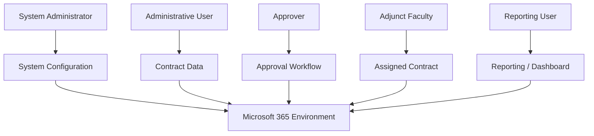
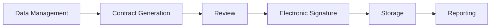
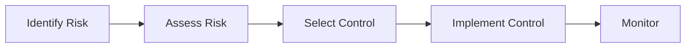
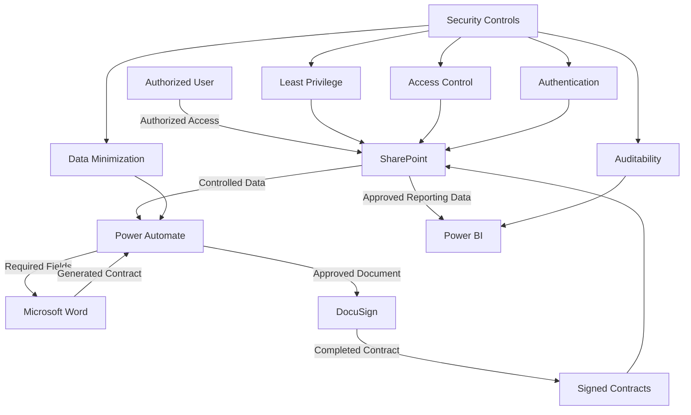

# Security & Compliance

## Overview

Security was considered throughout the design of the **Adjunct Faculty Contract Management System**.

The system processes contract-related information and therefore requires appropriate controls for:

* Access control
* Authentication
* Authorization
* Data protection
* Least privilege
* Document security
* Workflow security
* Auditability
* Information exposure
* Secure storage

The system uses Microsoft 365 services including SharePoint, Power Automate, Power BI, Microsoft Word, and DocuSign.

The security model can be summarized as:

```text
                    SECURITY
                       │
       ┌───────────────┼────────────────┐
       │               │                │
       ▼               ▼                ▼
 Access Control    Least Privilege   Data Protection
       │               │                │
       └───────────────┼────────────────┘
                       ▼
                 Secure Workflow
                       │
       ┌───────────────┼────────────────┐
       │               │                │
       ▼               ▼                ▼
    SharePoint    Power Automate     DocuSign
       │               │                │
       └───────────────┼────────────────┘
                       ▼
                   Power BI
```

Microsoft documents role-based SharePoint security at multiple levels, including sites, lists, libraries, folders, and individual items.

---

# Security Objectives

The project security objectives are:

1. Restrict access to authorized users.
2. Provide users only the permissions necessary for their responsibilities.
3. Protect contract-related information.
4. Reduce unnecessary information exposure.
5. Protect documents throughout the workflow.
6. Maintain useful workflow status information.
7. Prevent sensitive information from being published in the public GitHub repository.
8. Support a controlled and auditable workflow.

---

# 1. Access Control

Access control determines which users can access system resources.

The system contains multiple types of information:

```text
SharePoint
│
├── Faculty Information
│
├── Course Information
│
├── Contract Records
│
└── Signed Contracts
```

Not every user needs access to every type of information.

A role-based approach can therefore be used.

---

# Conceptual Role Model



The actual roles and permissions should be configured according to organizational requirements.

---

# 2. Least Privilege

Least privilege means providing a user or service only the permissions required to perform authorized tasks.

Microsoft defines least-privileged administration as assigning the minimum permissions necessary for users to complete authorized tasks.

The project applies this principle conceptually:

```text
User
  ↓
Required Task
  ↓
Required Resource
  ↓
Minimum Required Permission
```

For example:

```text
Reporting User
      ↓
View Dashboard
      ↓
Read Reporting Data
```

A reporting user should not automatically receive permission to modify contracts.

Similarly:

```text
Adjunct Faculty
      ↓
Assigned Contract
      ↓
Required Signing Access
```

An adjunct should not automatically receive administrative access to the entire contract-management system.

---

# 3. SharePoint Permissions

SharePoint provides role-based access control at multiple levels.

Permissions can be applied to:

* Sites
* Lists
* Document libraries
* Folders
* Documents
* List items

Microsoft documents SharePoint's role-based security model and support for unique permissions at lower levels when needed.

Conceptually:

```text
SharePoint Site
      │
      ├── Contract Lists
      │
      ├── Course Lists
      │
      └── Document Library
             │
             ├── Generated Contracts
             │
             └── Signed Contracts
```

Permissions should be designed so users receive access appropriate to their responsibilities.

---

# 4. Permission Groups

Groups can simplify permission management.

A conceptual permission model is:

| Role                 | Example Access                        |
| -------------------- | ------------------------------------- |
| System Administrator | Manage system configuration           |
| Administrative User  | Create and manage contract records    |
| Approver             | Review and approve assigned contracts |
| Adjunct Faculty      | Access assigned signing workflow      |
| Reporting User       | View approved reporting information   |

The exact permission levels should be determined by the organization.

Microsoft recommends using SharePoint groups and appropriate permission levels rather than unnecessarily managing access on an individual-user basis.

---

# 5. Preventing Oversharing

One important security concern for a document-management system is accidental oversharing.

Microsoft's current SharePoint documentation describes restricted site access controls using Microsoft 365 groups or Microsoft Entra security groups as a way to reduce oversharing.

Conceptually:

```text
User
  ↓
Is User Authorized?
  ↓
 ┌───────┴───────┐
 │               │
 YES             NO
 │               │
 ▼               ▼
Access         Denied
```

The system should avoid giving broad access simply because a user has access to the overall Microsoft 365 environment.

---

# 6. Data Protection

Contract-related information should be treated as organizational information requiring controlled access.

Examples include:

* Faculty information
* Course information
* Compensation-related information
* Contract documents
* Signature information
* Workflow status

The security model should therefore follow:

```text
Collect
   ↓
Process
   ↓
Store
   ↓
Access
   ↓
Report
```

At each stage, access should be limited to the information required for the task.

---

# 7. Data Minimization

Data minimization means avoiding unnecessary exposure of information.

The workflow should use only the fields necessary for:

* Contract generation
* Approval
* Signature
* Storage
* Reporting

Conceptually:

```text
Available Data
      ↓
Required Data
      ↓
Contract Workflow
```

Not every field available in a source system needs to appear in the contract or reporting dashboard.

---

# 8. Power Automate Security

Power Automate acts as the automation layer connecting the system components.

```text
SharePoint
    ↓
Power Automate
    ↓
Word
    ↓
DocuSign
    ↓
SharePoint
```

Because Power Automate can interact with data and documents, its connections and permissions should be controlled.

The workflow should avoid unnecessarily broad permissions.

For example:

```text
Automation
    ↓
Required SharePoint Resource
    ↓
Required Action
```

rather than:

```text
Automation
    ↓
Entire Organization
```

Microsoft documents Power Automate actions that can manage SharePoint item and file permissions, including granting access and stopping sharing.

---

# 9. Document Security

Contracts should remain in controlled organizational storage.

The document lifecycle is:

```text
Generated Contract
       ↓
Review
       ↓
Electronic Signature
       ↓
Completed Contract
       ↓
Controlled Storage
```

The completed contract should not be copied unnecessarily to uncontrolled locations.

---

# 10. Electronic Signature Security

DocuSign is used as the electronic-signature component.

The signing workflow is:

```text
Approved Contract
       ↓
DocuSign
       ↓
Authorized Signers
       ↓
Completed Contract
```

The signing process should ensure that documents are routed only to the intended participants.

The GitHub repository should never contain actual signed contracts.

---

# 11. Power BI Security

Power BI provides reporting and analytics.

The dashboard may contain information about:

* Contract status
* Pending contracts
* Completed contracts
* Processing activity
* Other approved metrics

The reporting layer should expose only information appropriate for the intended audience.

Conceptually:

```text
Raw Contract Data
       ↓
Approved Reporting Data
       ↓
Power BI
       ↓
Authorized Users
```

A dashboard intended for general reporting does not necessarily need to expose all underlying contract information.

---

# 12. Authentication

Users should authenticate through the organization's approved identity-management system.

Conceptually:

```text
User
  ↓
Authentication
  ↓
Authorization
  ↓
Resource Access
```

Authentication answers:

> Who is the user?

Authorization answers:

> What is the user allowed to access?

These should be treated as separate security controls.

---

# 13. Multi-Factor Authentication

For a production Microsoft 365 environment, multi-factor authentication should be considered an important identity-protection control.

Microsoft recommends requiring two-factor authentication for Microsoft 365 identities as a measure to reduce the impact of compromised passwords.

Conceptually:

```text
Username + Password
        +
Second Factor
        ↓
Authenticated User
```

The exact authentication policies are organizational configuration decisions and are not claimed here as part of the project implementation.

---

# 14. Auditability

The workflow should maintain useful information about contract processing.

Examples include:

* Contract status
* Processing date
* Approval status
* Signature status
* Completion status
* Workflow events

Conceptually:

```text
Contract
   ↓
Workflow Event
   ↓
Status Update
   ↓
Reporting
```

Auditability helps administrators understand where a contract is in the process and investigate unexpected workflow behavior.

---

# 15. Separation of Responsibilities

The system separates major business functions.



This separation reduces the need for one user to have unrestricted access to every part of the system.

---

# 16. Security Across the Workflow

The complete security model can be represented as:

```text
┌─────────────────────────────────────┐
│          Data Collection            │
│                                     │
│     Access Control / Validation     │
└──────────────────┬──────────────────┘
                   ↓
┌─────────────────────────────────────┐
│        Contract Generation          │
│                                     │
│      Controlled Data Mapping        │
└──────────────────┬──────────────────┘
                   ↓
┌─────────────────────────────────────┐
│             Review                  │
│                                     │
│       Human Oversight               │
└──────────────────┬──────────────────┘
                   ↓
┌─────────────────────────────────────┐
│          Electronic Signing         │
│                                     │
│       Authorized Signers            │
└──────────────────┬──────────────────┘
                   ↓
┌─────────────────────────────────────┐
│         Document Storage            │
│                                     │
│     Controlled SharePoint Access     │
└──────────────────┬──────────────────┘
                   ↓
┌─────────────────────────────────────┐
│             Reporting               │
│                                     │
│       Authorized Dashboard Access   │
└─────────────────────────────────────┘
```

---

# 17. Security Threat Considerations

The project should consider threats that could affect a contract-management system.

| Threat                           | Potential Impact                    | Security Consideration  |
| -------------------------------- | ----------------------------------- | ----------------------- |
| Unauthorized access              | Exposure of contract information    | Role-based access       |
| Excessive permissions            | Unnecessary data access             | Least privilege         |
| Oversharing                      | Unauthorized document access        | Controlled sharing      |
| Incorrect data                   | Incorrect contract                  | Validation              |
| Duplicate records                | Duplicate processing                | Duplicate detection     |
| Compromised credentials          | Unauthorized account access         | Strong authentication   |
| Sensitive data exposure          | Privacy/security impact             | Data minimization       |
| Incorrect workflow configuration | Incorrect routing                   | Testing and review      |
| Public repository exposure       | Disclosure of sensitive information | Sanitize GitHub content |

---

# 18. Risk Management Perspective

The project can be viewed using a basic risk-management approach:



### Example

**Risk:** Unauthorized user accesses contract information.

**Potential impact:** Exposure of sensitive information.

**Control:** Role-based SharePoint permissions.

**Additional control:** Restrict access to authorized groups.

**Monitoring:** Review permissions and access activity.

---

# 19. Security Control Mapping

The following table describes how common security principles relate to the project.

| Security Principle   | Project Implementation              |
| -------------------- | ----------------------------------- |
| Least Privilege      | Role-based access                   |
| Access Control       | SharePoint permissions              |
| Authentication       | Organizational identity system      |
| Authorization        | User/group permissions              |
| Data Minimization    | Only required fields used           |
| Secure Storage       | Controlled SharePoint libraries     |
| Auditability         | Workflow and status information     |
| Separation of Duties | Different workflow responsibilities |
| Data Protection      | Restricted document access          |
| Security Testing     | Workflow and access testing         |

---

# 20. Public GitHub Security

The public GitHub repository requires additional protection because it is intended to be publicly accessible.

The following information must **not** be published:

```text
Real Faculty Information
Real G-Numbers
Real Email Addresses
Real Contracts
Passwords
API Keys
Access Tokens
Connection Strings
Private SharePoint URLs
DocuSign Credentials
Microsoft 365 Credentials
University Confidential Information
```

Instead, use:

```text
Mock Data
Sanitized Examples
Generic Role Names
Architecture Diagrams
Workflow Documentation
Sample Screenshots Without Sensitive Data
```

---

# 21. Example Sanitized Data

Instead of publishing real information:

```text
Name: [REAL PERSON]
G#: [REAL ID]
Email: [REAL EMAIL]
```

use:

```text
Name: Sample Faculty
ID: SAMPLE-001
Email: sample@example.com
```

The purpose is to demonstrate the system without exposing real information.

---

# 22. Security-Aware Architecture

The overall architecture can be represented as:



---

# 23. Compliance Considerations

This project documentation describes **security-aware design considerations**, not a claim that the system itself has achieved a specific regulatory certification or compliance status.

The project should not claim compliance with standards or regulations unless the implementation has actually been assessed against the applicable requirements.

For example, this repository should avoid unsupported statements such as:

```text
"This system is fully HIPAA compliant."
```

or:

```text
"This system is FISMA certified."
```

unless there is documented evidence supporting those claims.

Instead, use language such as:

```text
"The system incorporates security controls and design principles
intended to reduce unauthorized access and information exposure."
```

---

# 24. Security Testing

Security-related testing should include:

### Access Testing

Verify that users receive the intended permissions.

### Unauthorized Access Testing

Verify that users cannot access resources outside their assigned responsibilities.

### Workflow Testing

Verify that contracts are routed to the correct workflow participants.

### Data Validation Testing

Verify that incomplete or invalid records do not proceed incorrectly.

### Document Testing

Verify that completed documents are stored in the intended location.

### Public Repository Review

Verify that no sensitive information has been accidentally committed to GitHub.

---

# 25. Security Design Summary

The project's security approach can be summarized as:

```text
                 SECURITY-AWARE DESIGN
                           │
        ┌──────────────────┼──────────────────┐
        │                  │                  │
        ▼                  ▼                  ▼
   Access Control    Least Privilege    Data Protection
        │                  │                  │
        └──────────────────┼──────────────────┘
                           ▼
                    Secure Workflow
                           │
        ┌──────────────────┼──────────────────┐
        │                  │                  │
        ▼                  ▼                  ▼
   SharePoint        Power Automate       DocuSign
        │                  │                  │
        └──────────────────┼──────────────────┘
                           ▼
                       Power BI
                           │
                           ▼
                     Controlled
                      Reporting
```

---

# Security Takeaways

The most important security concepts demonstrated by this project are:

1. **Least privilege**
2. **Role-based access control**
3. **Controlled document access**
4. **Data minimization**
5. **Secure workflow design**
6. **Human review**
7. **Status tracking**
8. **Auditability**
9. **Secure document storage**
10. **Public repository sanitization**

Microsoft's SharePoint security model supports role-based permissions across sites, lists, libraries, folders, and individual items, making these access-control concepts directly relevant to the platform used in this project.

---

# Portfolio Takeaway

This project demonstrates that workflow automation and cybersecurity are not separate concerns.

A business workflow that processes sensitive information must consider:

```text
Functionality
     +
Automation
     +
Access Control
     +
Data Protection
     +
Human Oversight
     +
Auditability
     =
Security-Aware System
```

The project therefore demonstrates experience with both **Microsoft 365 workflow automation** and fundamental **cybersecurity principles**.

---

# Public Repository Protection

This repository is a sanitized portfolio representation of the project.

No individual names or personal information should be included.

No real contracts, credentials, access tokens, private URLs, or confidential organizational data should be published.

All examples should use fictional or sanitized information.
