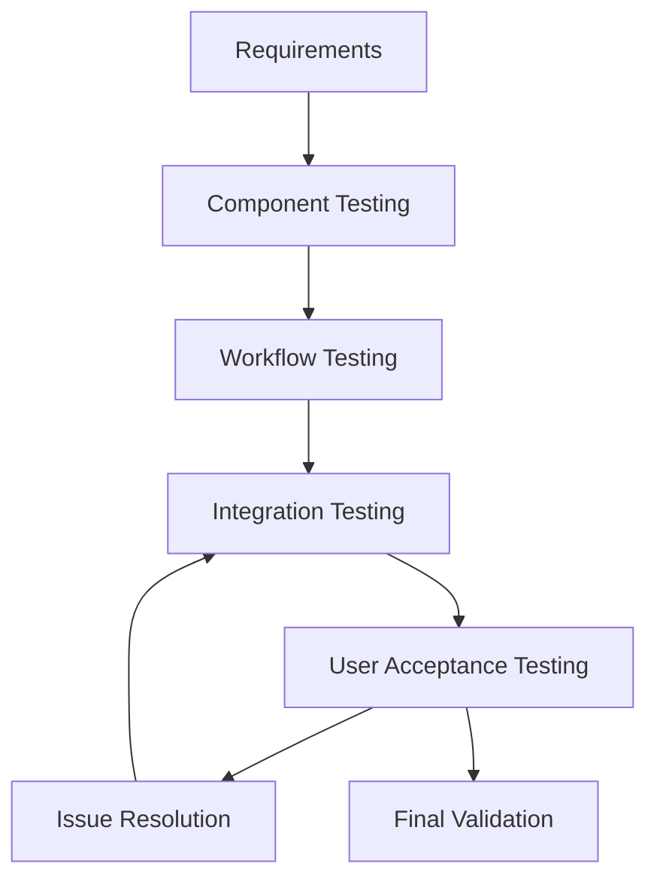
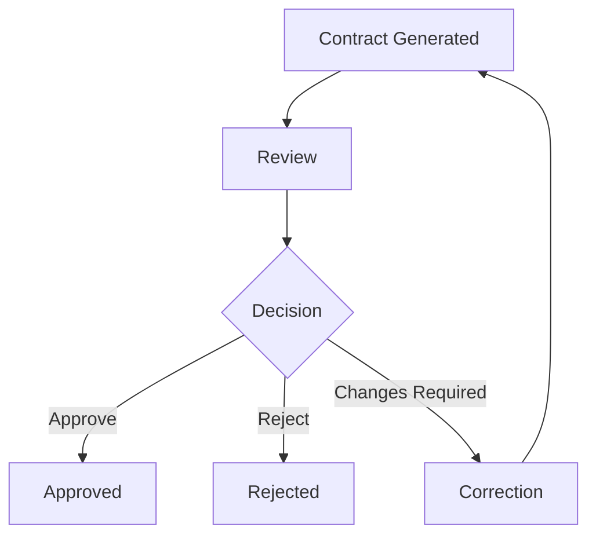
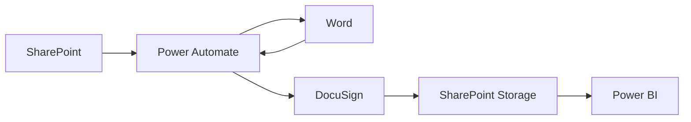
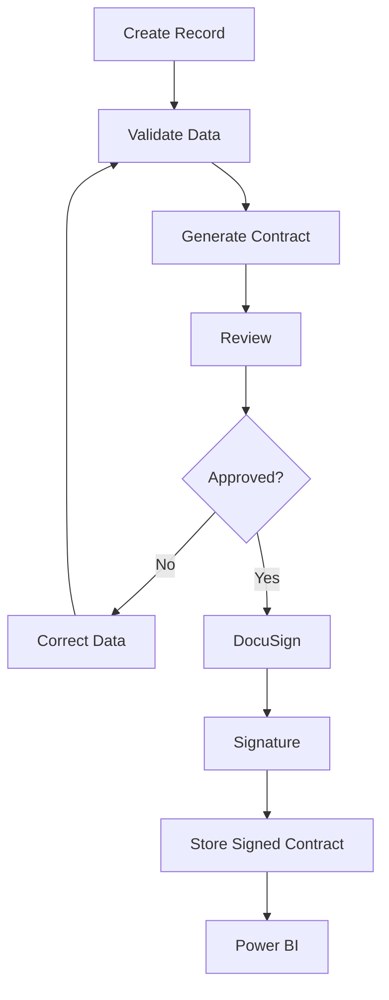
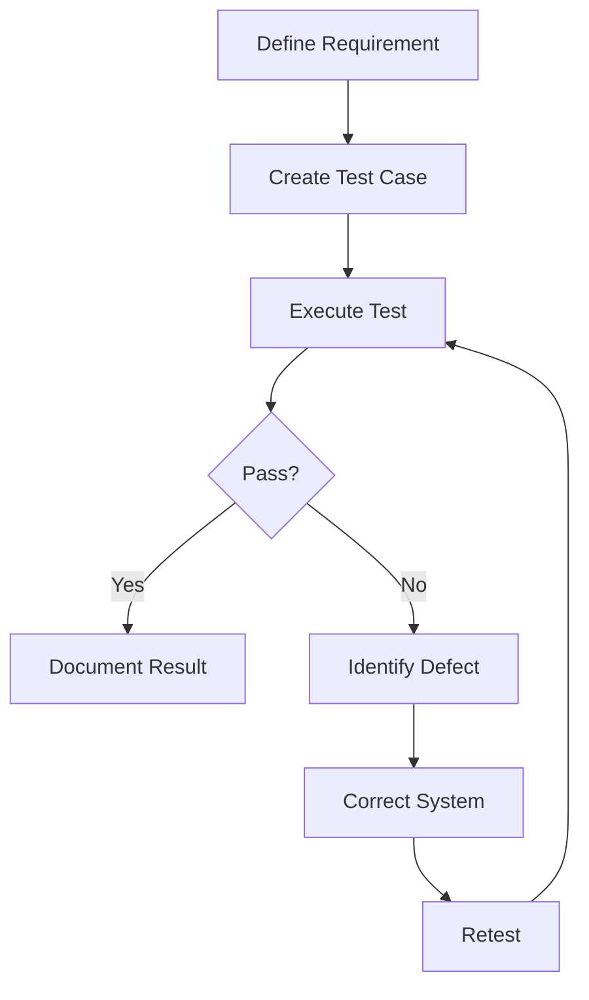

# Testing & Quality Assurance

## Overview

Testing was an important part of the development of the **Adjunct Faculty Contract Management System**.

The system contains multiple integrated components:

```text
SharePoint
    ↓
Power Automate
    ↓
Microsoft Word
    ↓
DocuSign
    ↓
SharePoint
    ↓
Power BI
```

Because the components depend on one another, testing must verify both individual functions and the complete workflow.

Microsoft recommends testing Power Automate cloud flows to improve reliability, performance, and accuracy, including testing different possible flow outcomes.

For Power BI, Microsoft recommends iterative development and validation, including developer validation and user acceptance testing (UAT).

---

# Testing Objectives

The primary testing objectives are:

1. Verify that data can be entered correctly.
2. Verify that invalid data is identified.
3. Verify that duplicate records are handled appropriately.
4. Verify that contracts can be generated.
5. Verify that generated contracts contain the expected information.
6. Verify that contracts follow the intended approval workflow.
7. Verify electronic-signature processing.
8. Verify contract status updates.
9. Verify signed-document storage.
10. Verify Power BI reporting.
11. Verify that users receive appropriate access.
12. Identify errors before deployment.

---

# Testing Strategy

The overall testing strategy is:



The process is iterative.

When an issue is discovered, the affected component is corrected and tested again.

---

# Testing Levels

The project can be tested at several levels.

```text
Component Testing
       ↓
Workflow Testing
       ↓
Integration Testing
       ↓
User Acceptance Testing
       ↓
Final Validation
```

---

# 1. Component Testing

Component testing focuses on individual system components.

Examples include:

* SharePoint lists
* SharePoint document libraries
* Power Automate flows
* Word templates
* DocuSign configuration
* Power BI reports

The goal is to verify that each component performs its intended function before relying on the complete workflow.

---

# 2. SharePoint Testing

SharePoint is the primary data and document-management layer.

Testing should verify:

* Lists can store expected data.
* Required fields behave correctly.
* Records can be created.
* Records can be updated.
* Documents can be stored.
* Generated contracts are associated with the appropriate records.
* Signed contracts are stored in the correct location.

---

# SharePoint Test Cases

| Test ID | Test                     | Expected Result                |
| ------- | ------------------------ | ------------------------------ |
| SP-01   | Create valid record      | Record is created              |
| SP-02   | Update record            | Updated values are saved       |
| SP-03   | Add course information   | Course information is stored   |
| SP-04   | Store generated contract | Document is stored             |
| SP-05   | Store signed contract    | Completed document is stored   |
| SP-06   | Verify status field      | Status reflects workflow state |

---

# 3. Data Validation Testing

Data validation helps prevent incorrect information from entering the workflow.

Example:

```text
Input Data
    ↓
Validation
    ↓
 ┌───────────────┐
 │               │
Valid          Invalid
 │               │
 ▼               ▼
Continue       Correct Data
```

Potential validation checks include:

* Missing required fields
* Invalid values
* Duplicate records
* Incorrect course information
* Incomplete contract information

---

# 4. Duplicate Prevention Testing

Duplicate prevention is important because duplicate records could result in duplicate contracts.

Example test:

```text
Record A
   ↓
Add Record
   ↓
Success

Same Record
   ↓
Add Again
   ↓
Duplicate Detection
```

Expected behavior:

```text
Duplicate detected
       ↓
Prevent duplicate processing
       ↓
Notify / flag record
```

The exact error-handling behavior depends on the implemented flow.

---

# 5. Power Automate Testing

Power Automate is responsible for much of the system's workflow automation.

Microsoft recommends testing cloud flows and examining their results to identify reliability, performance, and accuracy issues.

Power Automate testing should verify:

* Trigger conditions
* Data retrieval
* Data mapping
* Conditional logic
* Document generation
* Approvals
* Notifications
* Status updates
* Error handling

---

# Power Automate Test Cases

| Test ID | Test                     | Expected Result                 |
| ------- | ------------------------ | ------------------------------- |
| PA-01   | Create valid record      | Flow starts                     |
| PA-02   | Submit incomplete record | Validation identifies issue     |
| PA-03   | Generate contract        | Contract is created             |
| PA-04   | Approve contract         | Workflow proceeds               |
| PA-05   | Reject contract          | Workflow follows rejection path |
| PA-06   | Update status            | SharePoint reflects status      |
| PA-07   | Complete workflow        | Record reaches completed state  |

---

# 6. Contract Generation Testing

The contract-generation workflow should verify that information from SharePoint is correctly mapped into the Word template.

```text
SharePoint Record
       ↓
Power Automate
       ↓
Word Template
       ↓
Generated Contract
```

Test the following:

* Faculty information
* Course information
* Term
* Credit information
* Contract information
* Required fields
* Formatting
* Generated filename
* Document storage location

---

# Contract Generation Test Cases

| Test ID | Test                       | Expected Result                          |
| ------- | -------------------------- | ---------------------------------------- |
| CG-01   | Generate valid contract    | Contract generated                       |
| CG-02   | Verify faculty information | Correct information appears              |
| CG-03   | Verify course information  | Correct course appears                   |
| CG-04   | Verify term                | Correct term appears                     |
| CG-05   | Verify required fields     | Required information is present          |
| CG-06   | Verify storage             | Contract stored correctly                |
| CG-07   | Generate after correction  | Updated contract reflects corrected data |

---

# 7. Approval Testing

Approval workflows should be tested for both successful and unsuccessful outcomes.



Power Automate supports approval workflows in which a request can be routed to an approver and the resulting decision can update the underlying SharePoint record.

---

# Approval Test Cases

| Test ID | Test                   | Expected Result                 |
| ------- | ---------------------- | ------------------------------- |
| AP-01   | Approve valid contract | Contract proceeds               |
| AP-02   | Reject contract        | Rejection status recorded       |
| AP-03   | Request correction     | Contract returns for correction |
| AP-04   | Verify approval status | SharePoint reflects decision    |

---

# 8. DocuSign Workflow Testing

The electronic-signature portion should be tested after contract generation and approval.

```text
Approved Contract
       ↓
DocuSign
       ↓
Signature Process
       ↓
Completed Contract
```

Testing should verify:

* Correct document
* Correct recipients
* Correct signing sequence
* Status tracking
* Completion
* Exception handling
* Completed-document storage

---

# DocuSign Test Cases

| Test ID | Test                   | Expected Result                         |
| ------- | ---------------------- | --------------------------------------- |
| DS-01   | Send approved contract | Contract enters signing workflow        |
| DS-02   | Verify recipient       | Intended recipient receives request     |
| DS-03   | Complete signature     | Status becomes completed                |
| DS-04   | Verify signed document | Completed document is available         |
| DS-05   | Verify status update   | SharePoint status changes appropriately |

---

# 9. Reminder Testing

The system may use automated reminders for contracts that remain pending.

Example:

```text
Pending Contract
       ↓
Check Status
       ↓
Still Pending?
       ↓
Send Reminder
       ↓
Continue Monitoring
```

Test cases should verify that reminders are not sent after the contract has already been completed.

| Test ID | Test                    | Expected Result                   |
| ------- | ----------------------- | --------------------------------- |
| RM-01   | Pending contract        | Reminder condition detected       |
| RM-02   | Completed contract      | No unnecessary reminder           |
| RM-03   | Multiple pending checks | Workflow follows configured rules |

---

# 10. Status Tracking Testing

The system relies on status information to communicate the current state of a contract.

Example:

```text
Draft
 ↓
In Review
 ↓
Approved
 ↓
Pending Signature
 ↓
Completed
```

Possible exception states include:

```text
Rejected
Canceled
Expired
Needs Correction
```

Test that each workflow action results in the expected status.

---

# Status Test Cases

| Test ID | Action             | Expected Status   |
| ------- | ------------------ | ----------------- |
| ST-01   | Create record      | Draft             |
| ST-02   | Submit for review  | In Review         |
| ST-03   | Approve            | Approved          |
| ST-04   | Send for signature | Pending Signature |
| ST-05   | Complete signing   | Completed         |
| ST-06   | Reject             | Rejected          |
| ST-07   | Cancel             | Canceled          |

The actual status names should match the implementation.

---

# 11. Document Storage Testing

The system uses SharePoint for document management.

Testing should verify:

```text
Generated Contract
       ↓
Correct Library
       ↓
Correct Location
```

After signing:

```text
Completed Contract
       ↓
Signed Contracts
       ↓
Correct Storage Location
```

Test:

* Filename
* Document type
* Storage location
* Associated record
* Accessibility
* Permissions

---

# 12. Security Testing

Security testing should verify that users have appropriate access.

Examples:

```text
Authorized User
      ↓
Access Granted
```

and:

```text
Unauthorized User
      ↓
Access Denied
```

Security testing should consider:

* SharePoint permissions
* Document-library permissions
* User roles
* Dashboard access
* Workflow permissions
* Sensitive information exposure

Microsoft recommends considering security and organizational best practices when implementing SharePoint and Power Automate workflows.

---

# Security Test Cases

| Test ID | Test                                           | Expected Result                     |
| ------- | ---------------------------------------------- | ----------------------------------- |
| SEC-01  | Authorized user accesses assigned resource     | Access allowed                      |
| SEC-02  | Unauthorized user accesses restricted resource | Access denied                       |
| SEC-03  | Reporting user accesses dashboard              | Appropriate report access           |
| SEC-04  | User attempts administrative action            | Access follows assigned permissions |
| SEC-05  | Public GitHub review                           | No sensitive information present    |

---

# 13. Power BI Testing

Power BI is the reporting layer of the system.

Testing should verify:

* Data appears correctly
* Status counts are correct
* Filters work
* Visualizations reflect source data
* Dashboard information is understandable
* Users receive appropriate access

Microsoft recommends iterative development and validation of Power BI content, including developer validation and user acceptance testing.

---

# Power BI Test Cases

| Test ID | Test                    | Expected Result              |
| ------- | ----------------------- | ---------------------------- |
| BI-01   | Load report             | Report opens                 |
| BI-02   | Verify contract count   | Count matches source data    |
| BI-03   | Filter by status        | Correct records displayed    |
| BI-04   | Filter by term          | Correct data displayed       |
| BI-05   | Verify completed count  | Matches source data          |
| BI-06   | Verify dashboard access | Appropriate users can access |

---

# 14. Data Accuracy Testing

Data accuracy is especially important for reporting.

Example:

```text
SharePoint
100 Contracts
     ↓
Power BI
100 Contracts
```

If SharePoint contains:

```text
Completed = 60
Pending = 30
Rejected = 10
```

Power BI should represent the same underlying values.

The numbers above are only examples and are not claims about the actual project data.

---

# 15. Integration Testing

Integration testing verifies that components work together.



Each connection should be tested.

---

# Integration Test Cases

| Test ID | Integration                 | Expected Result           |
| ------- | --------------------------- | ------------------------- |
| INT-01  | SharePoint → Power Automate | Data retrieved            |
| INT-02  | Power Automate → Word       | Template populated        |
| INT-03  | Word → SharePoint           | Generated document stored |
| INT-04  | SharePoint → DocuSign       | Correct document sent     |
| INT-05  | DocuSign → SharePoint       | Status/document updated   |
| INT-06  | SharePoint → Power BI       | Reporting data available  |

---

# 16. End-to-End Testing

End-to-end testing verifies the entire business process.



The test should verify that a valid record can travel through the entire process without unexpected failure.

---

# End-to-End Test Scenario

## Scenario

A valid sample contract record is entered into the system.

### Expected sequence

```text
1. Record created
        ↓
2. Data validated
        ↓
3. Contract generated
        ↓
4. Contract reviewed
        ↓
5. Contract approved
        ↓
6. Contract sent for signature
        ↓
7. Signature completed
        ↓
8. Signed document stored
        ↓
9. Status updated
        ↓
10. Power BI reflects status
```

This is the most important integration scenario because it tests the complete business process.

---

# 17. Negative Testing

Testing should not only verify successful outcomes.

The system should also be tested with invalid or unexpected conditions.

Examples:

```text
Missing Data
Invalid Data
Duplicate Data
Rejected Contract
Canceled Contract
Incomplete Signature
Missing Document
Unauthorized Access
```

A negative test asks:

> Does the system fail safely and produce the expected result when something goes wrong?

Microsoft's testing guidance emphasizes testing different possible patterns and outcomes because a flow may run without technically failing while still producing an unexpected result.

---

# Negative Test Cases

| Test ID | Scenario               | Expected Result             |
| ------- | ---------------------- | --------------------------- |
| NEG-01  | Missing required field | Validation identifies issue |
| NEG-02  | Duplicate record       | Duplicate is detected       |
| NEG-03  | Contract rejected      | Rejection recorded          |
| NEG-04  | Signature incomplete   | Contract remains pending    |
| NEG-05  | Unauthorized access    | Access denied               |
| NEG-06  | Missing document       | Workflow handles exception  |
| NEG-07  | Invalid workflow input | Flow follows error path     |

---

# 18. User Acceptance Testing

User acceptance testing determines whether the system meets business requirements from the user's perspective.

```text
Development
     ↓
Testing
     ↓
User Review
     ↓
Feedback
     ↓
Corrections
     ↓
Validation
```

Microsoft describes UAT as testing performed by the user community to provide feedback and identify issues that developers may not have found.

---

# UAT Areas

Users should evaluate:

* Ease of navigation
* Data entry
* Contract generation
* Review process
* Signature workflow
* Status visibility
* Dashboard usability
* Document retrieval

---

# 19. Alpha / Beta / UAT Model

A useful project testing structure is:

```text
Alpha Testing
     ↓
Internal Testing
     ↓
Beta Testing
     ↓
Broader User Testing
     ↓
UAT
     ↓
Final Validation
```

The project's testing history can be documented using this model when supported by the project's actual records.

Do not claim a testing stage occurred unless there is evidence that it occurred.

---

# 20. Defect Tracking

Issues identified during testing should be recorded.

Example:

| Issue                    | Component           | Severity | Status   |
| ------------------------ | ------------------- | -------- | -------- |
| Missing field mapping    | Contract Generation | Medium   | Resolved |
| Incorrect status         | Power Automate      | Medium   | Resolved |
| Dashboard count mismatch | Power BI            | Medium   | Resolved |
| Permission problem       | SharePoint          | High     | Resolved |

These are example entries for demonstrating the defect-tracking format and are not claims about actual defects in the project.

---

# 21. Test Result Model

Each test can use a simple status:

```text
PASS
FAIL
BLOCKED
NOT TESTED
```

Example:

| Test                 | Result |
| -------------------- | ------ |
| Data validation      | PASS   |
| Contract generation  | PASS   |
| Approval workflow    | PASS   |
| Signature workflow   | PASS   |
| Dashboard validation | PASS   |

Only mark a test **PASS** when there is evidence that the test was actually completed successfully.

---

# 22. Testing Documentation

A useful test record contains:

```text
Test ID
Test Description
Input
Expected Result
Actual Result
Status
Notes
```

Example:

```text
Test ID: CG-01

Test:
Generate a contract from a valid record.

Input:
Valid sample SharePoint record.

Expected:
A Word contract is generated with the correct mapped fields.

Actual:
[Document actual result here]

Status:
[PASS / FAIL / BLOCKED / NOT TESTED]
```

---

# 23. Test Evidence

For a real implementation, useful evidence can include:

* Screenshots
* Power Automate run history
* SharePoint record
* Generated contract
* Approval result
* DocuSign status
* Signed-document record
* Power BI dashboard
* Test-case results

For a **public GitHub portfolio**, screenshots should be sanitized.

Do not publish real:

* Names
* Email addresses
* IDs
* Contracts
* Credentials
* Private URLs
* Organizational information

---

# 24. Test Environment

The project can be described as having the following logical test environment:

```text
Microsoft 365
│
├── SharePoint
│
├── Power Automate
│
├── Microsoft Word
│
├── DocuSign
│
└── Power BI
```

Testing should be performed with sample or authorized project data.

For public portfolio demonstrations, use fictional or sanitized data.

---

# 25. Quality Assurance Process

The overall quality-assurance process is:



This creates a repeatable testing process rather than relying only on informal testing.

---

# 26. Production Readiness Checklist

Before a production release, verify:

* [ ] Required fields validated
* [ ] Duplicate prevention tested
* [ ] Contract generation tested
* [ ] Approval workflow tested
* [ ] Rejection workflow tested
* [ ] Signature workflow tested
* [ ] Reminder behavior tested
* [ ] Status updates tested
* [ ] Document storage tested
* [ ] Permissions tested
* [ ] Power BI data validated
* [ ] Dashboard access tested
* [ ] Error conditions tested
* [ ] Sensitive information reviewed
* [ ] Public repository sanitized
* [ ] Documentation updated

---

# 27. Testing Principles

The project follows several important testing principles.

## Test Early

Testing should begin during development rather than waiting until the entire system is complete.

## Test Positive and Negative Cases

Verify both successful workflows and expected failure conditions.

## Test Integrations

Individual components may work correctly while the connection between components fails.

## Validate Data

Incorrect source data can produce incorrect contracts and reports.

## Retest After Changes

A correction to one component can affect another component.

## Document Results

Testing should produce evidence that requirements were evaluated.

---

# 28. Microsoft Guidance Alignment

The testing approach is consistent with Microsoft's current guidance in several areas.

Microsoft recommends testing Power Automate cloud flows for reliability, performance, and accuracy.

Microsoft also recommends iterative development and validation for Power BI solutions, including developer validation and user acceptance testing.

Microsoft's SharePoint and Power Automate documentation identifies approvals, list/file workflows, permissions, and reminder flows as common workflow scenarios.

---

# Testing Summary

The testing strategy can be summarized as:

```text
             REQUIREMENTS
                  ↓
             TEST DESIGN
                  ↓
        ┌─────────┴─────────┐
        ↓                   ↓
   Positive Tests      Negative Tests
        │                   │
        └─────────┬─────────┘
                  ↓
          Integration Tests
                  ↓
               UAT
                  ↓
           Final Validation
                  ↓
             Production
```

---

# Portfolio Takeaway

The testing process demonstrates an understanding that an automated business system must be validated at multiple levels.

The project combines:

* Functional testing
* Workflow testing
* Integration testing
* Negative testing
* Security testing
* Data validation
* User acceptance testing
* Reporting validation

This is particularly relevant to an IT or cybersecurity portfolio because reliable automation requires more than simply building a workflow.

The system must also demonstrate:

```text
Correctness
    +
Reliability
    +
Security
    +
Data Quality
    +
Usability
    =
Quality Solution
```

---

# Public Portfolio Note

This document describes the testing strategy and test-case structure for the project.

Only tests that were actually performed should be marked as **PASS** in a final project record.

Example test cases in this document are intended to explain the testing methodology and should not be interpreted as evidence that every example test was executed.

No real personal information, contracts, credentials, access tokens, or confidential organizational information should be published in this repository.
