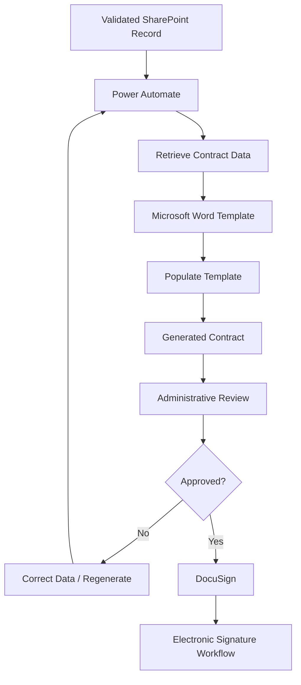
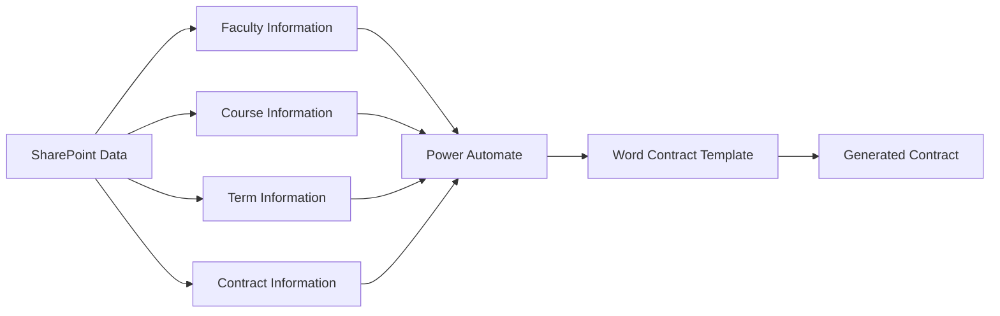
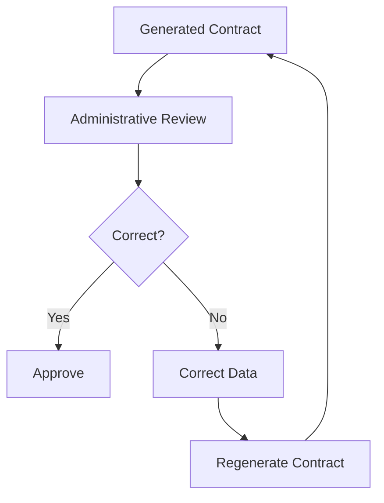
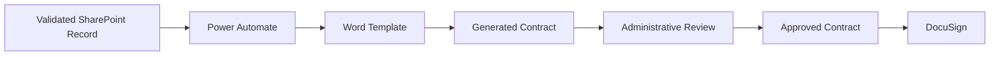

# Contract Generation & Processing Workflow

## Overview

The **Contract Generation & Processing** workflow is the second major stage of the Adjunct Faculty Contract Management System.

Its purpose is to take validated information from SharePoint, populate a standardized Microsoft Word contract template, allow the generated contract to be reviewed, and prepare the approved document for the electronic-signature workflow.

The overall process is:

```text
Validated SharePoint Record
          ↓
    Power Automate
          ↓
   Word Template
          ↓
 Generated Contract
          ↓
 Administrative Review
          ↓
     Approval
          ↓
      DocuSign
```

Microsoft's Word Online (Business) connector supports populating Word templates with values supplied by Power Automate. Microsoft documents using content controls in a Word template and then mapping those fields to values in a flow.

---

# High-Level Workflow



---

# 1. Retrieve Validated Data

The process begins after the data-collection workflow has successfully validated a record.

```text
SharePoint
    ↓
Validated Record
    ↓
Power Automate
```

The workflow retrieves the information needed to create the contract.

Examples of information used by the workflow may include:

* Adjunct faculty information
* Course information
* Term information
* Credit-hour information
* Contract-related information
* Other approved fields required by the contract template

Only information necessary for contract generation should be used.

---

# 2. Start Contract Generation

Power Automate acts as the orchestration layer.

```text
Validated Record
       ↓
Power Automate
       ↓
Contract Generation
```

The workflow maps values from the validated SharePoint record to the appropriate fields in the contract template.

Microsoft's Word Online (Business) connector provides a **Populate a Microsoft Word template** action specifically for reading a Word template and filling its fields with selected dynamic values.

---

# 3. Microsoft Word Contract Template

The contract is based on a standardized Word template.

Conceptually:

```text
Word Template
│
├── Contract Information
├── Adjunct Information
├── Course Information
├── Compensation Information
├── Terms / Conditions
└── Signature Information
```

The template provides a consistent structure while Power Automate supplies the variable information.

```text
Template
   +
Validated Data
   ↓
Generated Contract
```

Microsoft documents the use of Word content controls with Power Automate so that template fields can be populated automatically.

---

# 4. Populate the Contract

Power Automate maps data to the appropriate template fields.



This approach reduces repetitive manual data entry and improves consistency between generated contracts.

---

# 5. Save the Generated Contract

After the template has been populated, the generated document can be saved to the appropriate SharePoint location.

```text
Generated Contract
       ↓
SharePoint
       ↓
Contract Document
```

A centralized document repository makes it easier to locate and manage generated contracts.

Microsoft documents SharePoint document libraries as a supported location for Word files used with Power Automate.

---

# 6. Administrative Review

Automation does not eliminate the need for human review.

The generated contract should be reviewed before it enters the electronic-signature workflow.



### Review objectives

The reviewer should verify:

* Correct adjunct information
* Correct course information
* Correct term
* Correct compensation information
* Correct contract details
* Correct formatting
* No missing required information

---

# 7. Handling Corrections

If the generated contract contains an error, the workflow should not immediately send the incorrect document for signature.

Instead:

```text
Generated Contract
       ↓
Review
       ↓
Error Identified
       ↓
Correct Source Data
       ↓
Regenerate Contract
       ↓
Review Again
```

This helps prevent incorrect documents from entering the signature process.

---

# 8. Approval Decision

After review, the document follows one of two paths.

```text
                   Contract
                      ↓
                    Review
                      ↓
               ┌──────┴──────┐
               │             │
            Approved      Changes
               │             │
               ▼             ▼
           DocuSign      Correction
                             │
                             ▼
                         Regenerate
```

An approved contract proceeds to the electronic-signature stage.

A contract requiring changes returns to the correction process.

Microsoft documents Power Automate contract workflows that branch based on approval or rejection decisions.

---

# 9. Prepare the Contract for DocuSign

Once the contract has been approved, it is prepared for the electronic-signature workflow.

```text
Approved Contract
       ↓
SharePoint
       ↓
DocuSign
```

DocuSign documents using Power Automate to send envelopes and describes workflows where a SharePoint item or document can trigger an envelope-creation process.

---

# 10. Electronic Signature Handoff

The contract-generation workflow ends when the approved contract is successfully handed off to the signature process.



The next workflow takes responsibility for:

* Signature routing
* Signature status
* Reminders
* Completion
* Signed-document storage
* Reporting

---

# Contract Generation Data Flow

```text
┌──────────────────────────┐
│       SharePoint         │
│                          │
│ Validated Record         │
└────────────┬─────────────┘
             │
             ▼
┌──────────────────────────┐
│     Power Automate       │
│                          │
│ Retrieve / Map Data      │
└────────────┬─────────────┘
             │
             ▼
┌──────────────────────────┐
│    Microsoft Word        │
│                          │
│ Contract Template        │
└────────────┬─────────────┘
             │
             ▼
┌──────────────────────────┐
│    Generated Contract    │
└────────────┬─────────────┘
             │
             ▼
┌──────────────────────────┐
│  Administrative Review   │
└────────────┬─────────────┘
             │
             ▼
┌──────────────────────────┐
│        DocuSign          │
│                          │
│ Electronic Signature     │
└──────────────────────────┘
```

---

# Example Workflow Scenario

## Scenario

A validated adjunct faculty record is ready for contract generation.

### Step 1

Power Automate retrieves the validated record.

### Step 2

The workflow maps the required information to the Word template.

### Step 3

The Word template is populated.

### Step 4

A generated contract is created.

### Step 5

The contract is reviewed.

### Step 6

If corrections are needed, the source information is corrected and the contract is regenerated.

### Step 7

If the contract is approved, it proceeds to DocuSign.

```text
Validated Record
       ↓
Retrieve Data
       ↓
Populate Template
       ↓
Generate Contract
       ↓
Review
       ↓
 ┌─────┴─────┐
 │           │
Changes    Approved
 │           │
 ▼           ▼
Regenerate  DocuSign
```

---

# Exception Handling

## Missing Data

If required data is missing:

```text
Contract Generation
       ↓
Missing Field
       ↓
Stop / Correct Record
       ↓
Regenerate
```

The workflow should not generate a final contract containing incomplete required information.

---

## Incorrect Data

If incorrect information is discovered during review:

```text
Review
  ↓
Incorrect Information
  ↓
Correct SharePoint Record
  ↓
Regenerate Contract
  ↓
Review Again
```

---

## Template Error

If the template itself contains an error:

```text
Template Problem
      ↓
Update Template
      ↓
Regenerate
      ↓
Review
```

Template changes should be controlled because the template establishes the structure of generated contracts.

---

# Security Considerations

## Data Mapping

Only approved fields should be mapped from SharePoint into the contract.

## Access Control

Access to contract templates and generated documents should be restricted to authorized users.

## Least Privilege

Users and automation connections should have only the permissions required for their responsibilities.

## Document Protection

Generated contracts should remain in controlled organizational storage.

## Sensitive Information

Real faculty information, contracts, credentials, and other sensitive information should never be stored in this public GitHub repository.

---

# Why Automation Helps

The contract-generation workflow reduces repetitive manual processing.

### Manual Process

```text
Find Record
   ↓
Copy Data
   ↓
Open Template
   ↓
Enter Data
   ↓
Save Contract
   ↓
Review
   ↓
Send
```

### Automated Process

```text
Validated Record
      ↓
Power Automate
      ↓
Populate Template
      ↓
Review
      ↓
DocuSign
```

The automation does not remove human oversight. Instead, it moves repetitive data-entry work into the workflow while retaining a review step.

---

# Integration With the Next Workflow

The contract-generation process connects directly to the signing and reporting process.

```text
Data Collection
       ↓
Validated Record
       ↓
Contract Generation
       ↓
Administrative Review
       ↓
Approved Contract
       ↓
DocuSign
       ↓
Signing / Tracking / Reporting
```

The next stage is documented in:

`workflows/signing-and-reporting.md`

---

# Technology Summary

| Technology     | Role                                          |
| -------------- | --------------------------------------------- |
| SharePoint     | Source of validated data and document storage |
| Power Automate | Retrieves data and orchestrates generation    |
| Microsoft Word | Standardized contract template                |
| DocuSign       | Electronic-signature handoff                  |
| Power BI       | Downstream reporting                          |

Microsoft's current documentation confirms that Word Online (Business) can populate Word templates from Power Automate, while SharePoint provides supported document-library storage.

DocuSign's current documentation also demonstrates Power Automate workflows that create envelopes from SharePoint-based documents.

---

# Portfolio Takeaway

This workflow demonstrates the integration of:

* Structured data
* Workflow automation
* Document templates
* Human review
* Electronic signatures
* Controlled document storage

The key design principle is:

> **Automate repetitive processing while retaining human review for important business decisions.**

This creates a workflow that is more consistent and easier to monitor than a completely manual contract-generation process.
