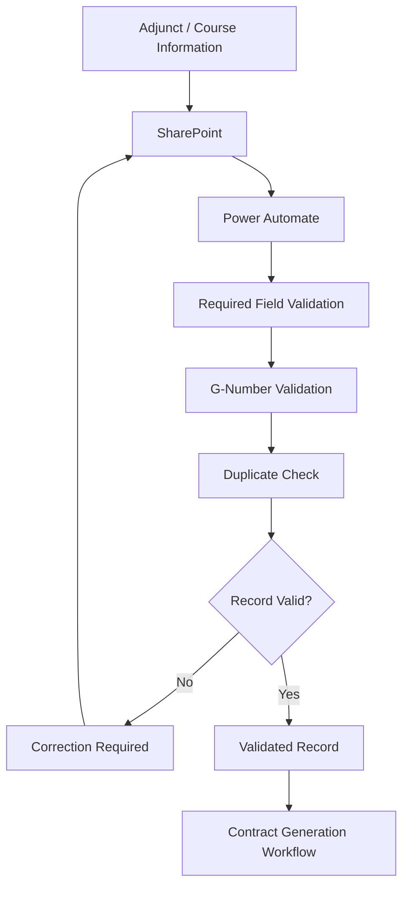
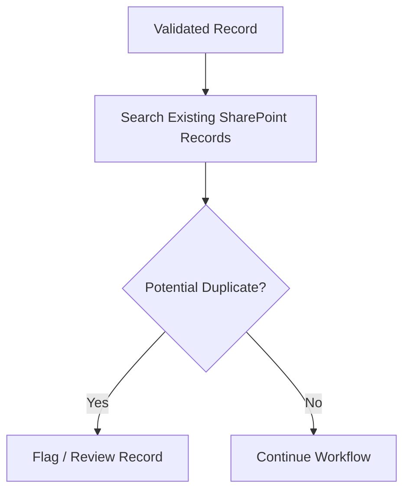
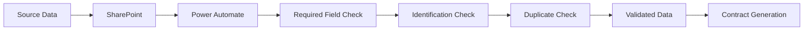

# Data Collection & Storage Workflow

## Overview

The Data Collection & Storage workflow is the first stage of the **Adjunct Faculty Contract Management System**.

Its purpose is to collect adjunct faculty and course information, validate the information, identify potential duplicate records, and store approved data in SharePoint for use by the contract-generation workflow.

The overall process is:

```text
Source Data
    ↓
SharePoint
    ↓
Power Automate
    ↓
Data Validation
    ↓
Duplicate Check
    ↓
Validated Record
    ↓
Contract Workflow
```

Microsoft documents SharePoint and Power Automate as an integrated platform for working with lists and files, monitoring changes, and creating automated workflows.

---

# High-Level Workflow



---

# 1. Collect Source Data

The workflow begins when adjunct faculty and course information becomes available to the system.

Data may originate from an approved source such as a spreadsheet or an existing organizational data source.

The information is then prepared for storage in SharePoint.

```text
Source Data
     ↓
Data Preparation
     ↓
SharePoint
```

The goal is to establish a centralized source for information required by the downstream contract workflow.

---

# 2. Store Data in SharePoint

SharePoint serves as the central data-management layer.

The project uses structured information for areas such as:

* Adjunct faculty records
* Course information
* Contract-related information
* Workflow status

Conceptually:

```text
SharePoint
│
├── Adjunct Faculty Information
│
├── Course Information
│
├── Contract Information
│
└── Workflow Status
```

Power Automate can retrieve items from SharePoint lists and files from SharePoint libraries as part of an automated workflow.

---

# 3. Start the Power Automate Workflow

After data is entered or imported, Power Automate processes the information.

A SharePoint trigger can monitor changes to a list or library and start a flow when the appropriate event occurs.

Conceptually:

```text
SharePoint Record
       ↓
Trigger
       ↓
Power Automate
```

The workflow then performs the validation steps required by the project.

---

# 4. Validate Required Information

The first validation stage checks whether the required information is present.

```text
Record
  ↓
Required Fields
  ↓
Complete?
```

If required information is missing:

```text
Missing Information
       ↓
Correction Required
       ↓
Record Updated
       ↓
Validation Repeated
```

If the required information is present, processing continues.

```text
Complete Record
      ↓
Next Validation
```

---

# 5. Validate Identification Information

The project workflow includes validation of the identification information required for contract processing.

The goal is to make sure the record contains the appropriate information before it proceeds to contract generation.

```text
Validated Required Fields
          ↓
Identification Validation
          ↓
Valid?
```

A record that does not meet the required validation criteria should not proceed to contract generation until it has been corrected.

---

# 6. Check for Duplicate Records

Duplicate detection is another important part of the workflow.

The system should identify records that could represent the same adjunct or course information before allowing them to continue.



The purpose of duplicate detection is to reduce inconsistent information and prevent unnecessary duplicate processing.

---

# 7. Validation Decision

After the validation checks are complete, the workflow makes a decision.

```text
                  Record
                    |
                    v
              Validation
                    |
             +------+------+
             |             |
           Valid         Invalid
             |             |
             v             v
       Continue        Correction
             |             |
             |             |
             +<------------+
```

### Valid record

A valid record can proceed to the contract-generation workflow.

### Invalid record

An invalid record requires correction before continuing.

---

# 8. Validated Data Becomes the Contract Source

Once the record passes validation, it becomes available to the next business process.

```text
Validated SharePoint Record
           ↓
Contract Generation
           ↓
Word Contract Template
```

This creates a connection between the **Data Collection & Storage** process and the **Contract Generation & Processing** process.

---

# Data Flow

The complete data flow can be represented as:



---

# Data Management Responsibilities

| Component        | Responsibility                                  |
| ---------------- | ----------------------------------------------- |
| Source Data      | Provides initial information                    |
| SharePoint       | Stores structured records                       |
| Power Automate   | Processes the workflow                          |
| Validation       | Checks required information                     |
| Duplicate Check  | Identifies potential duplicate records          |
| Validated Record | Provides trusted input to the contract workflow |

---

# Example Workflow Scenario

### Scenario

A new adjunct/course record is added to the system.

### Process

```text
1. Record added
       ↓
2. SharePoint stores record
       ↓
3. Power Automate detects record
       ↓
4. Required information checked
       ↓
5. Identification information checked
       ↓
6. Existing records checked
       ↓
7. Record approved for processing
       ↓
8. Contract workflow begins
```

If the record fails validation:

```text
Record
  ↓
Validation Failure
  ↓
Correction
  ↓
Validation
  ↓
Continue
```

---

# Exception Handling

## Missing Information

If required information is missing, the record should be corrected before contract generation.

## Duplicate Record

If a potential duplicate is identified, the record should be reviewed rather than automatically creating another contract.

## Invalid Information

If information does not meet the workflow's requirements, processing should stop until the issue is resolved.

These controls help prevent incomplete or inconsistent information from entering the contract-generation process.

---

# Security Considerations

Because the system handles personnel and contract-related information, access to the underlying SharePoint data should be controlled.

## Least Privilege

Users should receive only the access required for their responsibilities.

## Controlled Access

SharePoint permissions can control who can view or modify list items and documents. Power Automate also provides actions for managing permissions on SharePoint list items and files.

## Data Minimization

Only information necessary for the business process should be exposed to each user.

## Public Repository Protection

This GitHub repository should contain only sanitized documentation.

Do not publish:

* Real faculty information
* G-numbers
* Personal addresses
* Email addresses
* Real contracts
* Passwords
* API keys
* Connection credentials
* Private SharePoint URLs

---

# Why This Workflow Matters

The Data Collection & Storage process establishes a reliable foundation for the rest of the system.

Without validation, later processes could generate contracts using:

* Missing information
* Incorrect information
* Duplicate records
* Incomplete records

By validating the data before contract generation, the system improves consistency and reduces unnecessary manual correction.

---

# Relationship to the Next Workflow

After successful validation, the record moves into the next stage:

```text
Data Collection & Storage
            ↓
      Validated Record
            ↓
Contract Generation & Processing
```

The next workflow is documented in:

`workflows/contract-generation.md`

---

# Technology Summary

```text
                 DATA COLLECTION
                       |
                       v
                  SharePoint
                       |
                       v
                Power Automate
                       |
          +------------+------------+
          |            |            |
          v            v            v
      Required     Identification  Duplicate
       Fields         Check         Check
          |            |            |
          +------------+------------+
                       |
                       v
                Validated Record
                       |
                       v
              Contract Generation
```

SharePoint and Power Automate are designed to work together for list/file workflows, triggers, approvals, and automated processing, making this architecture consistent with the capabilities of the platform.
