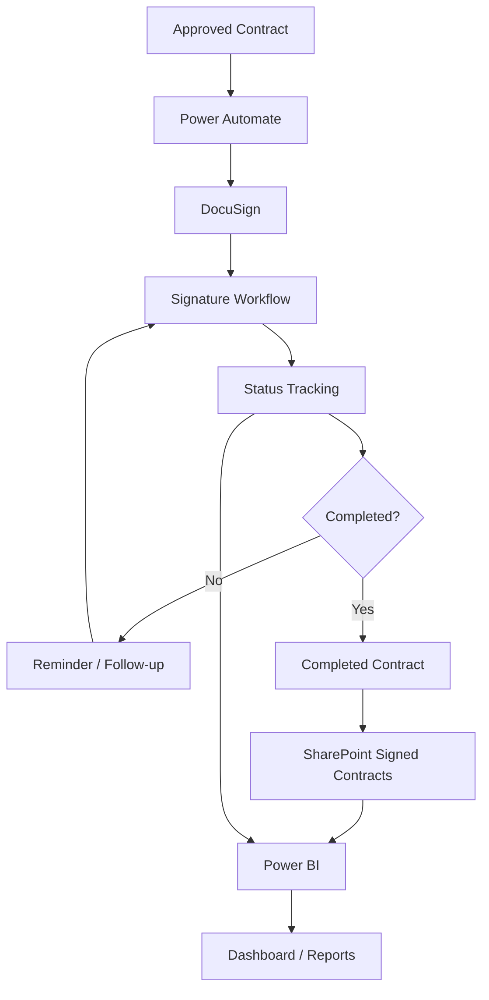
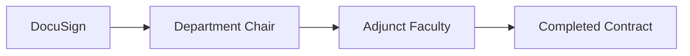
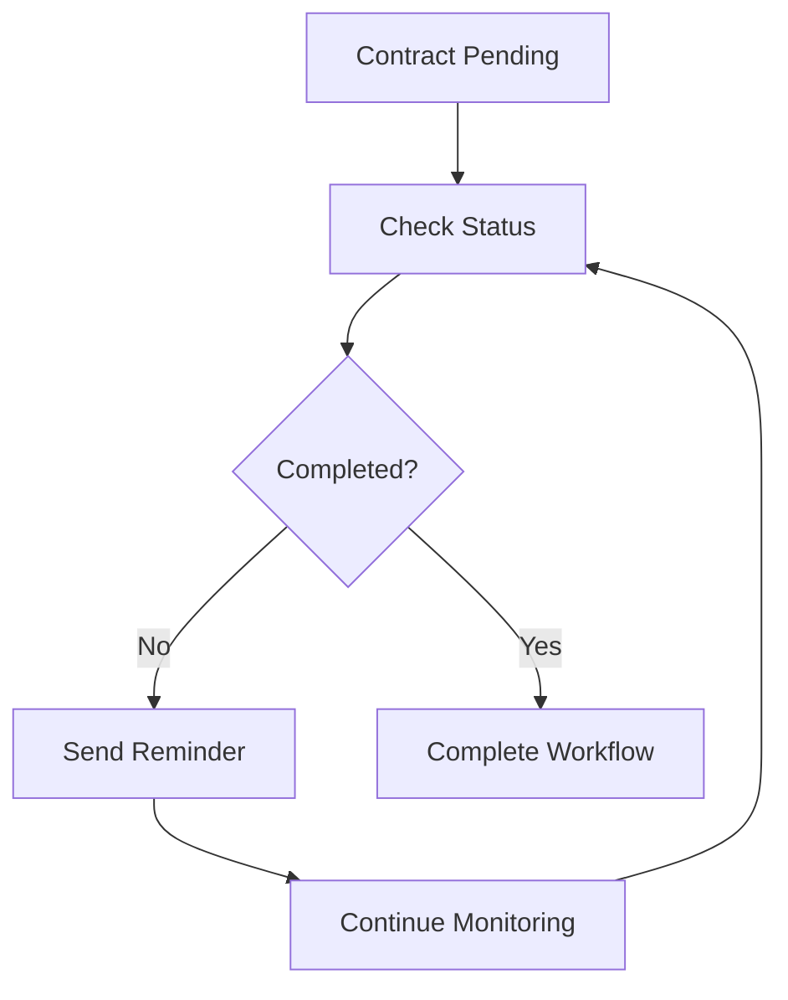
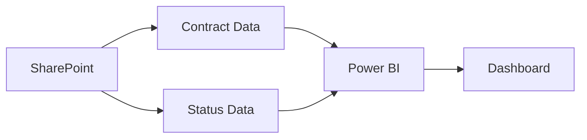
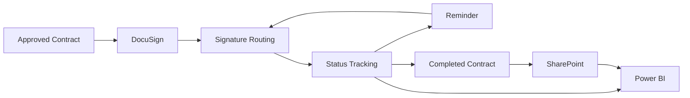
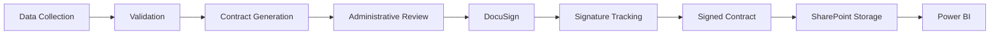

# Signing & Reporting Workflow

## Overview

The **Signing & Reporting Workflow** is the final major stage of the Adjunct Faculty Contract Management System.

This workflow begins after a contract has been generated and approved for electronic signature.

Its purpose is to:

* Send approved contracts for electronic signatures
* Track signature progress
* Provide reminders for incomplete signatures
* Update contract status
* Store completed contracts
* Provide reporting and analytics through Power BI

The overall process is:

```text
Approved Contract
       ↓
   DocuSign
       ↓
Signature Workflow
       ↓
Status Tracking
       ↓
Completed Contract
       ↓
SharePoint Storage
       ↓
Power BI Reporting
```

Microsoft documents Power Automate workflows that move contracts through approval processes and update contract status based on decisions.

---

# High-Level Architecture



---

# 1. Receive Approved Contract

The workflow starts after the contract has successfully passed the contract-generation and review process.

```text
Contract Generation
       ↓
Administrative Review
       ↓
Approved Contract
       ↓
Signing Workflow
```

The approved contract becomes the input for the electronic-signature process.

---

# 2. Send Contract to DocuSign

The approved contract is sent to DocuSign for electronic signing.

```text
Approved Contract
       ↓
SharePoint
       ↓
Power Automate
       ↓
DocuSign
```

DocuSign can be integrated into Power Automate workflows so that a document can be sent through an electronic-signature process. The integration can be used to automate envelope creation and signing workflows.

---

# 3. Signature Routing

The contract is routed to the appropriate participants according to the defined business process.

Conceptually:



The exact order of participants is determined by the contract workflow.

The important design principle is that the system tracks the document as it moves through the required signature steps.

---

# 4. Track Signature Status

The system tracks the status of the contract during the signature process.

Example statuses include:

```text
Draft
   ↓
In Review
   ↓
Pending Signature
   ↓
Partially Signed
   ↓
Completed
```

Additional statuses may be used for exceptions such as:

```text
Rejected
Canceled
Expired
Needs Correction
```

The exact status values should match the implementation used by the system.

---

# 5. Pending Signature

If a contract has not been completed, the workflow can identify it as pending.

```text
Contract
   ↓
Pending Signature
   ↓
Status Updated
```

A pending contract remains in the signing workflow until the required action is completed or an exception occurs.

---

# 6. Reminder Workflow

Reminders help reduce delays caused by incomplete signatures.



The project design can use Power Automate to monitor pending workflow conditions and initiate reminder actions.

Microsoft specifically lists SharePoint reminder flows among common SharePoint + Power Automate workflow scenarios.

---

# 7. Completed Contract

After all required signatures are completed, the contract enters the completed state.

```text
Pending Signature
       ↓
Required Signatures Complete
       ↓
Completed Contract
```

The completed document becomes the authoritative signed version for storage.

---

# 8. Store Signed Contract

Completed contracts are stored in the designated SharePoint document location.

```text
Completed Contract
       ↓
SharePoint
       ↓
Signed Contracts
```

Conceptually:

```text
SharePoint
│
├── Contract Records
│
├── Generated Contracts
│
└── Signed Contracts
       │
       ├── Completed Contract
       ├── Completed Contract
       └── Completed Contract
```

SharePoint is used as the centralized document-management layer in the overall architecture.

Microsoft's contract-management architecture uses SharePoint document libraries together with Power Automate to manage contract-processing workflows.

---

# 9. Update Contract Status

Once the signing process is completed, the contract record should reflect the current status.

```text
DocuSign
   ↓
Signature Completed
   ↓
Power Automate
   ↓
SharePoint Contract Record
   ↓
Status = Completed
```

This prevents users from having to manually determine whether every contract has been completed.

---

# 10. Reporting Data

Contract information and workflow status can then be used for reporting.

```text
SharePoint
     │
     ├── Contract Data
     │
     ├── Status
     │
     ├── Dates
     │
     └── Workflow Information
             ↓
          Power BI
```

Power BI serves as the reporting and visualization layer.

---

# 11. Power BI Dashboard

The reporting layer provides a high-level view of contract-processing activity.

Conceptually:



---

# Example Dashboard Metrics

The dashboard can display metrics such as:

* Total contracts
* Contracts pending review
* Contracts pending signature
* Completed contracts
* Rejected contracts
* Canceled contracts
* Contracts by term
* Contracts by status
* Processing trends

The exact metrics should reflect the actual implementation.

---

# 12. Status Reporting

A simplified reporting model can be represented as:

```text
                  CONTRACTS
                      |
        +-------------+-------------+
        |             |             |
        ▼             ▼             ▼
     Pending       Signed        Rejected
        |             |             |
        +-------------+-------------+
                      |
                      ▼
                   Power BI
                      |
                      ▼
                  Dashboard
```

This gives users a central location for understanding the current state of the contract workflow.

---

# End-to-End Signing Workflow



---

# Workflow Status Model

A simplified status model is:

```text
                    ┌──────────────┐
                    │    Draft     │
                    └──────┬───────┘
                           ↓
                    ┌──────────────┐
                    │   In Review  │
                    └──────┬───────┘
                           ↓
                  ┌──────────────────┐
                  │ Pending Signature│
                  └────────┬─────────┘
                           ↓
                  ┌──────────────────┐
                  │ Partially Signed │
                  └────────┬─────────┘
                           ↓
                    ┌──────────────┐
                    │   Completed  │
                    └──────┬───────┘
                           ↓
                    ┌──────────────┐
                    │   Archived   │
                    └──────────────┘
```

Exception states can branch from the workflow:

```text
In Review
    │
    ├── Rejected
    │
    └── Needs Correction

Pending Signature
    │
    ├── Canceled
    │
    └── Expired
```

---

# Exception Handling

## Signature Not Completed

If a required signer has not completed the contract:

```text
Pending
   ↓
Reminder
   ↓
Pending
   ↓
Signature
   ↓
Completed
```

---

## Contract Rejected

If the contract is rejected:

```text
Contract
   ↓
Rejected
   ↓
Status Updated
   ↓
Review / Correction
```

Microsoft's contract-management guidance uses Power Automate to branch workflow behavior based on approval or rejection and update status accordingly.

---

## Contract Canceled

A canceled contract should be marked appropriately so it does not continue to appear as an active pending contract.

```text
Active Contract
      ↓
Canceled
      ↓
Status Updated
      ↓
Reporting
```

---

## Signature Expiration

If the signing process expires before completion:

```text
Pending Signature
       ↓
Expiration
       ↓
Status Updated
       ↓
Review / Resend
```

The exact expiration and resend rules depend on the implemented DocuSign configuration.

---

# Security Considerations

## Controlled Access

Only authorized users should have access to contract records and completed documents.

## Least Privilege

Users should receive only the permissions required for their responsibilities.

## Document Protection

Completed contracts should remain in controlled organizational storage.

## Workflow Access

Power Automate connections should use appropriate organizational permissions.

## Reporting Access

Power BI dashboards should expose only information appropriate for the intended audience.

## Auditability

The workflow should maintain useful status information showing where contracts are in the process.

---

# Data Flow

```text
                   APPROVED CONTRACT
                          |
                          ▼
                    POWER AUTOMATE
                          |
                          ▼
                       DOCUSIGN
                          |
                          ▼
                  SIGNATURE WORKFLOW
                          |
             +------------+------------+
             |                         |
             ▼                         ▼
          Pending                  Completed
             |                         |
             ▼                         ▼
         Reminder                 SharePoint
             |                         |
             +------------+------------+
                          |
                          ▼
                       POWER BI
                          |
                          ▼
                  STATUS DASHBOARD
```

---

# Complete System Workflow

The signing and reporting workflow connects the earlier stages of the project into one end-to-end process.



---

# Technology Responsibilities

| Technology     | Responsibility                            |
| -------------- | ----------------------------------------- |
| SharePoint     | Data and signed-document storage          |
| Power Automate | Workflow automation and status processing |
| Word           | Contract generation template              |
| DocuSign       | Electronic signature workflow             |
| Power BI       | Reporting and analytics                   |

Microsoft's current documentation describes Power Automate as deeply integrated with SharePoint for approval flows, files/lists, permissions, and reminder workflows.

---

# Business Benefits

## Faster Processing

Automated routing and notifications reduce repetitive manual work.

## Better Visibility

Status information allows users to see where contracts are in the workflow.

## Reduced Errors

Automated status updates and standardized processing reduce manual tracking.

## Centralized Storage

Completed contracts are maintained in a centralized document-management environment.

## Reporting

Power BI provides a reporting layer for contract-processing information.

## Scalability

The workflow can be extended with additional automation, validation, notifications, or reporting.

---

# Security-Aware Design

The workflow incorporates several security principles:

```text
Least Privilege
      +
Controlled Access
      +
Secure Storage
      +
Data Minimization
      +
Workflow Auditability
      =
Security-Aware Contract Workflow
```

These principles are particularly important because contract-management systems may contain sensitive personnel and compensation-related information.

---

# Portfolio Summary

The Signing & Reporting workflow demonstrates the integration of:

* SharePoint
* Power Automate
* DocuSign
* Power BI

The workflow connects contract approval, electronic signatures, status tracking, document storage, and analytics into one automated process.

The complete system can therefore be represented as:

```text
DATA
  ↓
SHAREPOINT
  ↓
POWER AUTOMATE
  ↓
CONTRACT GENERATION
  ↓
REVIEW
  ↓
DOCUSIGN
  ↓
SIGNATURES
  ↓
SHAREPOINT
  ↓
POWER BI
  ↓
REPORTING
```

---

# Public Portfolio Protection

This GitHub repository should contain only sanitized project documentation.

Do not publish:

* Real faculty records
* Personal information
* G-numbers
* Email addresses
* Real contracts
* Credentials
* Passwords
* API keys
* Private SharePoint URLs
* DocuSign credentials
* Organizational secrets

Use mock data and diagrams when demonstrating the workflow publicly.
